# Rapport de stage EWAT — détection précoce et typage des anomalies microservices

> **Rapport complet** (toutes les sections rédigées, registre professionnel). Cible : `.docx`
> (titres `#`/`##`/`###`/`####` stricts pour conversion Pandoc propre). Tous les chiffres sont
> tracés vers `docs/rapport/chiffres.md` (source unique de vérité). Avant rendu : compléter sur la
> page de garde les informations administratives (`‹À COMPLÉTER›`) et le tableau d'endpoints en
> annexe D. Les marqueurs `▸ Source` / `▸ lien` sont des notes de traçabilité internes, à retirer à
> la conversion finale.

---

## FRONT MATTER

### Page de garde
EWAT — Détection précoce et typage automatique des anomalies dans les architectures microservices
Kubernetes. Rapport de stage, Devoteam.
‹À COMPLÉTER : auteur, tuteur entreprise, tuteur académique, établissement, période du stage,
logos.›

### Résumé (français)
Les systèmes de détection d'anomalies dans les architectures microservices confondent
fréquemment les changements bénins — déploiements, autoscaling — avec de véritables anomalies, ce qui
produit une masse de faux positifs en production. Ce stage, mené chez Devoteam, présente EWAT (Early
Warning and Anomaly Typing), une démarche qui sépare explicitement ces régimes avant de typer et
d'anticiper les pannes. EWAT formalise un graphe de services G(t), un signal de télémétrie à
dix-sept dimensions S(t) = [métriques | traces | logs] et quatre régimes opérationnels, dont le
régime mixte drift∩anomalie. Le pipeline enchaîne quatre étapes : détection de drift par MMD à
features de Fourier aléatoires, encodage spatio-temporel sur graphe, typage contrastif par clustering,
et précurseurs typés ; une ontologie empirique hors ligne donne un sens aux types. Le travail
distingue rigoureusement les résultats obtenus sur cible indépendante (les labels d'injection Chaos
Mesh) de ceux, circulaires, obtenus sur la cible du pipeline lui-même. Sur cible indépendante, le
modèle atteint un macro-AUROC de 0,920 (intervalle de confiance à 95 % [0,878 ; 0,956]) et une
précursion temporelle réelle. Les types d'anomalies se structurent nettement (silhouette 0,782). À
l'inverse, plusieurs résultats négatifs sont revendiqués : l'échec de la séparation drift/anomalie par
look-through, la non-généralisation à des types de pannes inédits, et l'instabilité du nombre de
clusters. Le pipeline est rapide (latence p95 de 13 ms) et testé (586 tests unitaires). La
contribution centrale est autant méthodologique que technique : évaluer honnêtement, en séparant le
défendable du circulaire et en assumant les échecs.
Mots-clés : détection précoce, drift conceptuel, microservices, Kubernetes, typage d'anomalies,
ontologie, transfer entropy.

### Abstract (English)
Anomaly detection systems for microservice architectures frequently confuse benign change —
deployments, autoscaling — with genuine anomalies, producing large numbers of false positives in
production. This internship at Devoteam introduces EWAT (Early Warning and Anomaly Typing), an
approach that explicitly separates these regimes before typing and anticipating faults. EWAT
formalises a service graph G(t), a seventeen-dimensional telemetry signal S(t) = [metrics | traces |
logs] and four operational regimes, including the mixed drift∩anomaly regime. The pipeline chains
four stages: drift detection via MMD with Random Fourier Features, spatio-temporal graph encoding,
contrastive typing by clustering, and typed precursors; an offline empirical ontology gives meaning
to the types. The work strictly distinguishes results on an independent target (Chaos Mesh injection
labels) from circular results on the pipeline's own target. On the independent target, the model
reaches a macro-AUROC of 0.920 (95 % confidence interval [0.878, 0.956]) with genuine temporal
precursion. Anomaly types are clearly structured (silhouette 0.782). Conversely, several negative
results are claimed as contributions: the failure of look-through drift/anomaly separation, the lack
of generalisation to unseen fault types, and the instability of the number of clusters. The pipeline
is fast (13 ms p95 latency) and tested (586 unit tests). The core contribution is as much
methodological as technical: evaluating honestly, separating the defensible from the circular and
owning the failures.
Keywords: early warning, concept drift, microservices, Kubernetes, anomaly typing, ontology,
transfer entropy.

### Sommaire
▸ Source : table des matières auto-générée à la conversion (Pandoc / Word, profondeur 4 niveaux).

### Liste des figures
1. Carte des valeurs manquantes (ewat_v3) — §6.2.2
2. Longueur des épisodes v3 vs v4 — §6.3.1
3. Architecture du pipeline EWAT — §7.1
4. Carte de chaleur scénario × cluster — §7.6.5
5. Chaîne opérationnelle (reframing) — §7.7.4
6. Distributions du MMD² (normal vs chaos) — §8.2
7. AUROC par type d'anomalie — §8.6.1
8. Transfert few-shot RCAEval — §8.10.2
9. Courbes ROC / précision–rappel (AlertAssembler) — §8.11.3
10. Matrice de confusion (attribution de cluster) — §8.11.3
11. Ablation par modalité pour H3 — §8.12.2
12. Distribution par graine (multi-graines) — §9.4.2

### Liste des tableaux
▸ Source : table auto-générée. Tableaux principaux : 17 features (§4.2.4), comparatif des datasets
(§6.6), comparatif des encodeurs (§7.5.4 et §8.11.1), AUROC par type (§8.6.1), headline défendable
v3/v4 (§8.7.3), ablations modalités (§8.12), verdict multi-graines (§9.7), bilan des hypothèses
(§11.1), limites principales (§12.1.3).

### Liste des acronymes
| Sigle | Signification |
|---|---|
| EWAT | Early Warning and Anomaly Typing |
| RCA | Root Cause Analysis (analyse de cause racine) |
| K8s | Kubernetes |
| RKE2 | Rancher Kubernetes Engine 2 |
| OTel | OpenTelemetry |
| OTLP | OpenTelemetry Protocol |
| MMD | Maximum Mean Discrepancy |
| RFF | Random Fourier Features |
| STGCN | Spatio-Temporal Graph Convolutional Network |
| GCN | Graph Convolutional Network |
| GAT | Graph Attention Network |
| TCN | Temporal Convolutional Network |
| SimCLR | Simple framework for Contrastive Learning of Representations |
| TE | Transfer Entropy |
| KSG | estimateur Kraskov–Stögbauer–Grassberger |
| FDR | False Discovery Rate |
| BH | Benjamini–Hochberg |
| OWL / RDF | Web Ontology Language / Resource Description Framework |
| TBox / ABox | terminologie (classes) / assertions (individus) d'une ontologie |
| SHAP | SHapley Additive exPlanations |
| OOD | Out-Of-Distribution |
| LOSO | Leave-One-Scenario-Out |
| BCa | Bias-Corrected and accelerated (bootstrap) |
| IC | Intervalle de Confiance |
| AUROC | Area Under the ROC Curve |
| PR-AUC | Area Under the Precision–Recall Curve |
| FPR / TPR | False / True Positive Rate |
| NMI | Normalized Mutual Information |
| JVM | Java Virtual Machine |

### Glossaire
- **Drift (bénin)** : changement de distribution du signal dû à une évolution normale du système
  (déploiement, autoscaling), sans dégradation effective.
- **Look-through** : mécanisme de l'étape 0 qui, lors d'un drift, transmet le signal avec un drapeau
  plutôt que de l'annuler, afin de ne pas masquer une anomalie concomitante.
- **MMD-RFF** : test à deux échantillons (Maximum Mean Discrepancy) approché par Random Fourier
  Features, de coût O(nD).
- **STGCN** : encodeur combinant convolution spatiale sur graphe et convolution temporelle causale.
- **GAT** : variante d'encodeur remplaçant la convolution de graphe par de l'attention sur les arêtes.
- **SimCLR** : pré-entraînement contrastif produisant des représentations invariantes aux
  augmentations.
- **Réseau siamois** : réseau entraîné par paires pour rapprocher les épisodes de même type et
  éloigner les autres.
- **TE-KSG** : Transfer Entropy estimée par la méthode KSG, mesure d'information dirigée entre séries.
- **OpenMax** : méthode de reconnaissance open-set signalant les classes inédites par théorie des
  valeurs extrêmes.
- **BCa** : intervalle de confiance bootstrap biais-corrigé et accéléré.
- **LOSO** : validation croisée retirant un scénario entier de l'entraînement.
- **FDR** : taux de fausses découvertes contrôlé en tests multiples.
- **Régime θ** : état opérationnel du système (normal, drift, anomalie, drift∩anomalie).
- **Précurseur** : classifieur estimant la probabilité qu'un type d'anomalie se développe à un
  horizon donné.
- **Fenêtre pré-injection** : fenêtre temporelle prélevée dans le régime normal, avant l'injection de
  chaos.
- **Signature statique de scénario** : information distinctive d'un scénario récupérable à tout
  instant du régime normal (par opposition à une dynamique précurseur).

---

# 1 Introduction
▸ Budget pages : 3

## 1.1 Cadre du stage et commanditaire
### 1.1.1 Devoteam, mission d'observabilité et contexte client
Le projet s'est déroulé chez Devoteam, dans un contexte de conseil et d'ingénierie en observabilité de
plateformes Kubernetes. Le travail a porté sur EWAT (Early Warning and Anomaly Typing), un projet de
recherche appliquée sur la détection précoce et le typage automatique des anomalies dans les
architectures microservices. Les informations administratives (encadrement, période) figurent en page
de garde.

### 1.1.2 Insertion du sujet dans une problématique de production
Le sujet répond à un besoin concret d'exploitation : les équipes qui opèrent des microservices sont
submergées d'alertes, dont une large part correspond à des changements parfaitement normaux
(déploiements, montées en charge). EWAT cherche à séparer ces changements bénins des anomalies
réelles, puis à les typer et à les anticiper.

## 1.2 Motivation : le coût des faux positifs en production
### 1.2.1 Confusion drift bénin / anomalie réelle
Les systèmes de détection d'anomalies actuels confondent fréquemment les drifts bénins — un
déploiement progressif, un autoscaling — avec de véritables anomalies. Or les deux produisent des
changements de distribution dans la télémétrie. Sans distinction explicite, toute évolution du signal
risque de déclencher une alerte.

### 1.2.2 Conséquence opérationnelle (fatigue d'alerte, perte de confiance)
La conséquence est une masse de faux positifs en production : fatigue d'alerte, perte de confiance
dans l'outil, et au bout du compte des alertes ignorées. C'est précisément l'écart entre performance
sur benchmark et déployabilité que pointe la littérature récente (§3.2.4). EWAT prend ce problème de
front en traitant la séparation drift/anomalie comme une étape à part entière.

## 1.3 Énoncé du problème et question de recherche
Le problème se formule ainsi : étant donné le flux de télémétrie d'une architecture microservices,
peut-on, *avant* qu'une panne ne survienne, distinguer les changements bénins des anomalies, typer
l'anomalie qui se développe et estimer son horizon ? Ce travail relève de l'early-warning (quoi, dans
combien de temps) et non de l'analyse de cause racine (où, pourquoi, après) — une distinction
développée en §2.3.

## 1.4 Contributions du stage
### 1.4.1 Contributions méthodologiques
Sur le plan méthodologique, le stage apporte : une formalisation à quatre régimes opérationnels (dont
le régime mixte drift∩anomalie, §4.4) ; un pipeline en quatre étapes (détection de drift, encodage
sur graphe, typage contrastif, précurseurs typés, §4.5) ; et une ontologie empirique des pannes
ancrée dans la littérature (§10).

### 1.4.2 Contributions empiriques (dont résultats négatifs)
Sur le plan empirique, le stage établit un résultat défendable sur cible indépendante (macro-AUROC
0,920, §8.7) et documente honnêtement plusieurs résultats négatifs — échec du look-through (H2a),
fuite de signature de scénario, instabilité du nombre de clusters, échec du transfert externe — qui
sont autant de contributions à part entière (synthèse en §11).

### 1.4.3 Contributions logicielles et dataset
Sur le plan logiciel, le travail livre un pipeline modulaire (six modules, 586 tests unitaires), une
chaîne de collecte reproductible en trois phases, et plusieurs itérations de dataset (v3, v4,
v4_strat, rcaeval) culminant avec le pivot v5 vers Train Ticket, dont le dataset est destiné à une
publication potentielle.

## 1.5 Organisation du document
Le document suit l'évolution du projet. Le chapitre 2 pose le contexte et le positionnement ; le
chapitre 3 la revue de littérature ; le chapitre 4 la formalisation. Les chapitres 5 à 7 décrivent
l'environnement, les itérations de dataset et l'architecture. Les chapitres 8 et 9 rassemblent les
résultats et la validation de robustesse, le chapitre 10 l'ontologie. Les chapitres 11 à 13
synthétisent, discutent les limites et concluent.

---

# 2 Contexte, problématique et positionnement (early-warning ≠ RCA)
▸ Budget pages : 5

## 2.1 Architectures microservices et observabilité
### 2.1.1 Caractéristiques des systèmes microservices Kubernetes
Une architecture microservices décompose une application en services autonomes communiquant par le
réseau, déployés et mis à l'échelle indépendamment sur un orchestrateur comme Kubernetes. Cette
souplesse a un revers pour l'observabilité : la topologie évolue en permanence (réplicas, rerouting),
les défaillances se propagent en cascade, et la charge fluctue. Le cluster de travail
(observit-cluster1, §5.1) est un environnement réel présentant ces caractéristiques.

### 2.1.2 Les trois piliers : métriques, traces, logs
L'observabilité repose sur trois piliers complémentaires : les métriques (séries temporelles
agrégées : CPU, mémoire, latence…), les traces distribuées (le cheminement d'une requête à travers
les services) et les logs (les événements textuels émis par les services). EWAT exploite les trois,
qui forment les trois modalités du signal S(t) (§4.2).

### 2.1.3 Stack existante : Prometheus/Grafana + OpenTelemetry
Le cluster dispose de deux stacks coexistantes : Prometheus + Grafana pour les métriques matures, et
un collecteur OpenTelemetry pour les traces et logs instrumentés via OTLP. Cette dualité est un atout
— métriques d'un côté, traces et logs de l'autre, corrélables par les conventions sémantiques OTel
(§5.2).

## 2.2 Drift conceptuel vs anomalie : définitions opérationnelles
### 2.2.1 Drift bénin (déploiement, autoscaling, rolling update)
On appelle drift bénin un changement de distribution du signal causé par une évolution normale du
système : déploiement progressif d'une nouvelle version, autoscaling, montée de trafic planifiée. Le
signal change, mais le système reste sain. Un détecteur naïf le confond avec une panne.

### 2.2.2 Anomalie réelle (panne, dégradation)
Une anomalie réelle est une dégradation effective : saturation de ressource, fuite mémoire, crash,
latence anormale, erreurs en hausse. C'est ce que l'on veut détecter et typer, en le distinguant du
drift bénin.

### 2.2.3 Le cas mixte : déploiement défectueux (θ_{drift∩anomaly})
Le cas le plus délicat est le déploiement défectueux : un drift (déploiement) et une anomalie (le bug
introduit) surviennent simultanément. C'est un quatrième régime à part entière, θ_{drift∩anomaly},
que la plupart des approches ignorent en ne raisonnant qu'en trois régimes. EWAT le modélise
explicitement (§4.4) et tente de l'identifier (hypothèse H2b).

## 2.3 Positionnement : early-warning n'est pas du RCA
### 2.3.1 RCA = post-mortem (Où / Pourquoi, après la panne)
L'analyse de cause racine (RCA) cherche, après une panne, à en identifier l'origine — quel service,
quelle cause. C'est une démarche post-mortem, qui suppose que l'incident a déjà eu lieu. La majorité
des travaux sur la fiabilité des microservices relève de cette catégorie (§3.2.4).

### 2.3.2 Early-warning = anticipation (Quoi / Dans combien de temps, avant)
EWAT se place en amont : il s'agit d'anticiper — quel type d'anomalie se développe, et à quel horizon
— avant que la panne ne survienne. La question n'est pas « pourquoi est-ce tombé », mais « qu'est-ce
qui va tomber, et dans combien de temps ». Cette distinction est structurante : elle interdit, par
exemple, d'utiliser des informations post-incident dans l'évaluation.

### 2.3.3 Tableau comparatif RCA vs EWAT
| Axe | RCA | EWAT (early-warning) |
|---|---|---|
| Question | Où ? Pourquoi ? | Quoi ? Dans combien de temps ? |
| Instant | après la panne | avant la panne |
| Sortie | cause racine | type d'anomalie + horizon |
| Évaluation | localisation correcte | AUROC par type, lead time |

### 2.4 Objectifs et critères de succès du projet
### 2.4.1 Objectifs fonctionnels
Les objectifs fonctionnels sont : (1) séparer drift bénin et anomalie ; (2) typer automatiquement les
anomalies à partir d'une taxonomie empirique ; (3) anticiper le type avec un horizon utile ; (4) le
faire dans un budget de latence compatible avec une exploitation en ligne (< 5 s, §4.6).

### 2.4.2 Critères de falsifiabilité (renvoi H1–H3)
Chaque objectif est rattaché à une hypothèse falsifiable — H1 (structurabilité des types), H2a/H2b
(séparabilité du drift, identification du régime mixte), H3 (prédictibilité) — avec un critère de
falsification explicite (§4.7). Cette discipline de falsifiabilité est volontaire : elle permet de
revendiquer les résultats négatifs comme des contributions.

## 2.5 Périmètre, contraintes et hors-périmètre
Le périmètre est borné par les conditions d'accès au cluster : namespace-admin sur `ewat`, sans
droits cluster-wide (§5.1.2). EWAT n'est pas un outil de RCA et ne prétend pas l'être. Il ne couvre
pas non plus la remédiation automatique : sa sortie est une alerte typée et anticipée, à charge de
l'opérateur d'agir.

---

# 3 État de l'art et conséquences sur la formalisation
▸ Budget pages : 10

## 3.1 Méthodologie de revue de littérature
La revue est organisée en deux niveaux. Le premier (§3.2) rassemble onze références fondatrices qui
cadrent le problème : détection d'anomalies, performance des systèmes, drift conceptuel, analyse de
cause racine, clustering et estimation de l'information. Chacune est présentée selon une grille
uniforme — (a) apport, (b) conclusion ou limite que l'on retient, (c) ce que l'on en tire pour la
formalisation EWAT (§4) — afin que le lien entre littérature et choix de conception soit explicite et
traçable. Le second niveau (§3.3) recense les briques méthodologiques et techniques effectivement
utilisées dans le pipeline, chacune rattachée à l'étape qu'elle justifie. La sélection privilégie les
travaux directement réutilisés dans EWAT plutôt qu'un panorama exhaustif du domaine.

## 3.2 Niveau 1 — Références fondatrices

### 3.2.1 Détection d'anomalies — fondations et séries temporelles profondes
#### 3.2.1.1 Chandola, Banerjee & Kumar (2009) — Anomaly Detection: A Survey
**(a)** Ce survey de référence structure le champ : il distingue anomalies ponctuelles,
contextuelles et collectives, et classe les familles de techniques selon la nature des données et la
disponibilité de labels. **(b)** Sa leçon centrale, qu'on retient, est qu'une anomalie n'est définie
que relativement à un contexte ; le même point peut être normal ou anormal selon le régime. **(c)**
Cela fonde directement notre choix de modéliser explicitement le régime opérationnel θ(t) (§4.4) au
lieu de traiter le signal de façon stationnaire : la séparation drift/anomalie n'est qu'un cas
particulier de cette dépendance au contexte.

#### 3.2.1.2 Zamanzadeh Darban et al. (2024) — Deep Learning for Time Series Anomaly Detection
**(a)** Ce survey récent dresse la taxonomie des approches profondes pour la détection d'anomalies en
séries temporelles (prévision, reconstruction, méthodes hybrides). **(b)** Il pointe que la plupart
des méthodes sont évaluées sur benchmarks, ciblent des anomalies ponctuelles et ignorent la
non-stationnarité — un écart benchmark/production que nous voulons éviter. **(c)** Cela motive
l'emploi d'un encodeur opérant sur une fenêtre temporelle (§7.4) et la précaution méthodologique de
toujours évaluer sur cible indépendante (§8.7), plutôt que sur la cible auto-référente du modèle.

### 3.2.2 Performance systèmes et indicateurs précurseurs
#### 3.2.2.1 Gregg (2013) — Systems Performance (méthodologie USE, queue depth)
**(a)** Gregg formalise la méthode USE (Utilisation, Saturation, Erreurs) pour diagnostiquer la
performance d'un système, et identifie la profondeur de file d'attente comme indicateur avancé d'une
dégradation. **(b)** La méthode est manuelle et orientée hôte unique, mais son cadrage des grandeurs
à surveiller est directement transposable. **(c)** Les sept métriques de M(t) (§4.2) reprennent cette
grille — saturation, erreurs, et surtout la profondeur de file (`queue_depth`) comme signal
précurseur — et l'agrégation différenciée par composante (§4.3) en découle.

### 3.2.3 Drift conceptuel dans les flux non supervisés
#### 3.2.3.1 Hinder et al. (2024) — Concept drift in unsupervised data streams
**(a)** Les auteurs formalisent le drift conceptuel dans des flux non supervisés et proposent des
méthodes de détection sans labels. **(b)** Le cadre est générique et pensé pour de longs flux
continus ; il ne traite pas la distinction entre drift bénin et anomalie. **(c)** Il fonde notre
étape 0 (§7.2), tout en éclairant son résultat négatif : sur des épisodes courts, la confirmation
temporelle du drift ne suffit pas à le séparer d'une anomalie (§8.3).

#### 3.2.3.2 Myrtollari et al. (2025) — Concept drift-aware anomaly detection for K8s microservices
**(a)** Ce travail propose une détection d'anomalies tenant compte du drift, spécifiquement pour des
microservices Kubernetes — un cadre très proche du nôtre. **(b)** Il confirme que la séparation
drift/anomalie est le bon problème, sans pour autant modéliser explicitement le régime mixte
déploiement-défectueux. **(c)** EWAT opérationnalise cette séparation par un quatrième régime
θ_{drift∩anomaly} (§4.4) et un filtre look-through (§7.2), et documente honnêtement les limites de ce
dernier.

### 3.2.4 Analyse de cause racine en microservices (frontière à ne pas franchir)
#### 3.2.4.1 Fu et al. (2025) — Intelligent RCA in Microservice Systems: A Survey
**(a)** Ce survey récent fait le point sur l'analyse de cause racine (RCA) en microservices. **(b)**
Il identifie un écart persistant entre performance sur benchmark et déployabilité en production,
largement dû aux faux positifs. **(c)** C'est l'argument de positionnement d'EWAT (§2.3) : on fait de
l'early-warning (quoi, dans combien de temps, avant) et non du RCA (où, pourquoi, après), et c'est
précisément le problème des faux positifs sur drift bénin qui motive le projet.

#### 3.2.4.2 Pham et al. (2024) — RCA based on Causal Inference: How Far Are We?
**(a)** Cette étude évalue de façon critique les approches de RCA fondées sur l'inférence causale.
**(b)** Elle montre que ces méthodes restent fragiles et sensibles à leurs hypothèses sur des données
réelles. **(c)** Cela justifie deux choix : utiliser la Transfer Entropy non paramétrique (KSG)
plutôt qu'un graphe causal pour l'ontologie (§10.3), et cantonner cette analyse causale au hors-ligne
(étape 2b) au lieu d'en faire un RCA en ligne.

#### 3.2.4.3 GrayScope (2024) — Non-intrusive gray failure localization
**(a)** GrayScope localise les « pannes grises » — des défaillances partielles peu visibles dans la
télémétrie standard — de façon non intrusive. **(b)** Le travail reste une localisation (proche du
RCA), pas une prédiction. **(c)** La notion de panne grise éclaire directement notre bug réel F1
(§6.5) : un bug logique silencieux, invisible dans les métriques, traces et logs — d'où notre
résultat négatif honnête sur sa non-détectabilité.

### 3.2.5 Clustering et sélection du nombre de groupes
#### 3.2.5.1 Kaufman & Rousseeuw (1990) — Finding Groups in Data (seuil silhouette)
**(a)** Cet ouvrage introduit le coefficient de silhouette et une grille d'interprétation de ses
valeurs. **(b)** On en retient le seuil conventionnel de 0,3, en dessous duquel la structure de
clusters est jugée faible. **(c)** C'est le critère de falsification de H1 (§4.7, §8.4) : une
silhouette held-out inférieure à 0,3 falsifierait la structurabilité des types.

#### 3.2.5.2 Tibshirani, Walther & Hastie (2001) — Gap statistic
**(a)** La statistique de gap estime le nombre de clusters K en comparant la dispersion intra-cluster
à celle d'une référence nulle. **(b)** Elle offre une alternative principielle à la silhouette pour
choisir K, mais reste sensible à la taille de l'échantillon. **(c)** On l'emploie comme second
estimateur de K ; sa divergence avec la silhouette documente l'instabilité de K sur notre dataset
(§9.4, §9.5).

### 3.2.6 Estimation de l'information et causalité
#### 3.2.6.1 Kraskov, Stögbauer & Grassberger (2004) — Estimating mutual information (KSG)
**(a)** L'estimateur KSG mesure l'information mutuelle par les k plus proches voisins, sans supposer
de forme paramétrique. **(b)** Il est adapté aux dépendances non linéaires, au prix d'une sensibilité
à la dimension et à la longueur de série. **(c)** Il fonde notre estimation de la Transfer Entropy
pour les relations causales de l'ontologie (§10.3), et sa contrainte de longueur (T ≥ 5·d) explique
le recours aux épisodes synthétiques allongés (§10.6).

## 3.3 Niveau 2 — Fondements méthodologiques et briques techniques

### 3.3.1 Encodeurs et apprentissage de représentations sur graphes
#### 3.3.1.1 Yu, Yin & Zhu (2018) — STGCN
Réseau de convolution spatio-temporel sur graphe, conçu à l'origine pour la prévision de trafic, qui
combine convolution spatiale et convolution temporelle causale. *Justifie l'encodeur de l'étape 1*
(§7.4), appliqué ici au graphe de services pondéré.

#### 3.3.1.2 Kipf & Welling (2017) — GCN
Formulation spectrale de la convolution sur graphe, fondation théorique des couches GCN. *Justifie la
brique de convolution graphe* utilisée dans l'adjacence pondérée (§4.1, §7.4).

#### 3.3.1.3 Veličković et al. (2018) — GAT
Introduit l'attention sur les arêtes (Graph Attention Network), apprenant une pondération adaptative
du voisinage. *Justifie la variante d'encodeur comparée* en §7.5.3.

#### 3.3.1.4 Chen et al. (2020) — SimCLR
Cadre d'apprentissage contrastif (perte NT-Xent) produisant des représentations invariantes aux
augmentations. *Justifie le pré-entraînement contrastif* évalué en §7.5.2.

#### 3.3.1.5 Eldele et al. (2021) — TS-TCC
Adapte l'apprentissage contrastif aux séries temporelles par contraste temporel et contextuel.
*Justifie le choix d'augmentations temporelles* pour la variante SimCLR (§7.5.2).

### 3.3.2 Détection de drift par tests à noyau
#### 3.3.2.1 Gretton et al. (2012) — Kernel Two-Sample Test / MMD
Le test à deux échantillons par noyau mesure l'écart entre deux distributions via la Maximum Mean
Discrepancy (MMD²). *Justifie le test de l'étape 0* (§7.2).

#### 3.3.2.2 Rahimi & Recht (2007) — Random Fourier Features
Approxime un noyau par projection aléatoire de Fourier, ramenant le coût du MMD à O(nD). *Justifie
l'implémentation MMD-RFF* qui rend l'étape 0 compatible avec le budget de latence (§7.2, §4.6).

### 3.3.3 Causalité, raisonnement et ontologie
#### 3.3.3.1 Schreiber (2000) — Transfer Entropy
Définit la Transfer Entropy, mesure d'information dirigée d'une série vers une autre. *Justifie
l'analyse causale de l'étape 2b* (§10.3), estimée ici par KSG plutôt que par causalité de Granger.

#### 3.3.3.2 Benjamini & Hochberg (1995) — FDR
Contrôle le taux de fausses découvertes en tests multiples. *Justifie le seuillage des relations
causales* de l'ontologie (§10.3).

#### 3.3.3.3 Holm (1979) — correction de Holm
Procédure de test multiple séquentiellement rejetante, plus conservatrice que Bonferroni simple.
*Justifie la correction des tests de co-occurrence* χ²/Fisher (§10.4).

#### 3.3.3.4 Soldani & Brogi (2022) — taxonomie des pannes microservices
Catalogue les anti-patterns et modes de défaillance des applications microservices. *Justifie
l'ancrage de la TBox de l'ontologie* dans la littérature plutôt que dans des labels ad hoc (§10.2).

#### 3.3.3.5 Motter & Lai (2002) — défaillances en cascade
Modèle fondateur des défaillances en cascade par redistribution de charge sur les réseaux. *Justifie
la relation `propagatesThrough`* et les classes de propagation de l'ontologie (§10.2).

#### 3.3.3.6 Glimm et al. (2014) — HermiT
Raisonneur OWL 2 vérifiant la cohérence et matérialisant les inférences. *Justifie le raisonnement sur
l'ontologie* (§10.5).

#### 3.3.3.7 Lamy (2017) — owlready2
Bibliothèque Python de programmation orientée ontologie, interfaçant OWL et les raisonneurs. *Justifie
l'outillage* de construction et d'interrogation de l'ontologie (§10.5).

### 3.3.4 Interprétabilité
#### 3.3.4.1 Lundberg & Lee (2017) — SHAP / KernelSHAP
Cadre unifié d'attribution fondé sur les valeurs de Shapley. *Justifie la validation des fiches de
type* (§8.9), après le rejet du gradient × input jugé non fiable (ρ = −0,34).

### 3.3.5 Open-set et détection hors-distribution
#### 3.3.5.1 Bendale & Boult (2016) — OpenMax
Reconnaissance open-set par théorie des valeurs extrêmes, capable de signaler une classe inédite.
*Justifie le dispositif open-set opérationnel* évalué en §9.6.

#### 3.3.5.2 Lee et al. (2018) — Mahalanobis OOD
Détecteur hors-distribution par distance de Mahalanobis aux classes connues. *Justifie une piste de
travaux futurs* pour la généralisation aux types inédits (§12.2).

#### 3.3.5.3 Liu et al. (2020) — Energy-based OOD
Score hors-distribution fondé sur une énergie, alternative à OpenMax. *Justifie une seconde piste de
travaux futurs* (§12.2).

### 3.3.6 Statistiques, bootstrap et clustering sphérique
#### 3.3.6.1 Efron (1987) — BCa
Intervalles de confiance bootstrap biais-corrigés et accélérés. *Justifie les intervalles de
confiance* sur AUROC et silhouette (§8, §9).

#### 3.3.6.2 Davison & Hinkley (1997) — méthodes de bootstrap
Ouvrage de référence sur le rééchantillonnage. *Justifie le cadre général* des intervalles bootstrap
employés (§9.3).

#### 3.3.6.3 Phipson & Smyth (2010) — p-values de permutation
Montre qu'une p-value de permutation ne doit jamais être nulle et donne son estimation exacte.
*Justifie le test de permutation A3* et les seuils par permutation de la Transfer Entropy (§9.1.3,
§10.3).

#### 3.3.6.4 Agresti (2002) — analyse de données catégorielles
Référence sur les tests χ² (correction de Yates) et exact de Fisher pour tableaux 2×2. *Justifie les
tests de co-occurrence* de l'ontologie (§10.4).

#### 3.3.6.5 Dhillon & Modha (2001) — spherical k-means
Clustering sur la sphère unité avec métrique cosinus. *Justifie le choix average + cosinus* sur
embeddings L2-normalisés (§7.6), à l'origine du gain de silhouette de H1.

### 3.3.7 Sémantique des logs
#### 3.3.7.1 Reimers & Gurevych (2019) — Sentence-BERT
Produit des embeddings de phrases via un réseau BERT siamois. *Justifie le score d'anomalie
sémantique* des logs dans L(t) (§4.2).

### 3.3.8 Benchmark externe
#### 3.3.8.1 Pham et al. (2025) — RCAEval RE2-OB
Benchmark public de RCA en microservices (variante Online-Boutique). *Justifie le jeu de transfert
externe ewat_rcaeval* (§6.4, §8.10).

## 3.4 Synthèse de l'état de l'art et conséquences pour EWAT
### 3.4.1 Tableau de synthèse (référence → conclusion → brique EWAT)
| Référence | Conclusion / limite retenue | Brique EWAT |
|---|---|---|
| Chandola 2009 | l'anomalie est relative au contexte | régimes θ (§4.4) |
| Zamanzadeh 2024 | écart benchmark/production, anomalies ponctuelles | encodeur fenêtré (§7.4), éval. indépendante (§8.7) |
| Gregg 2013 | USE + queue depth = indicateur avancé | métriques M(t) (§4.2) |
| Hinder 2024 | drift formalisable sans labels | étape 0 drift (§7.2) |
| Myrtollari 2025 | séparation drift/anomalie pertinente | régime mixte + look-through (§4.4, §7.2) |
| Fu 2025 | RCA limité par les faux positifs | positionnement early-warning (§2.3) |
| Pham 2024 | RCA causal fragile | TE-KSG hors-ligne (§10.3) |
| GrayScope 2024 | pannes grises invisibles en télémétrie | bug F1, négatif honnête (§6.5) |
| Kaufman 1990 | seuil silhouette 0,3 | critère H1 (§4.7, §8.4) |
| Tibshirani 2001 | gap statistic pour K | sélection de K (§9.4) |
| Kraskov 2004 | estimateur KSG d'information | TE de l'ontologie (§10.3) |
| Yu 2018 | STGCN spatio-temporel | encodeur étape 1 (§7.4) |
| Kipf & Welling 2017 | convolution spectrale sur graphe | adjacence pondérée (§4.1) |
| Veličković 2018 | attention sur arêtes | variante GAT (§7.5.3) |
| Chen 2020 | contraste NT-Xent | pré-entraînement SimCLR (§7.5.2) |
| Eldele 2021 | contraste séries temporelles | augmentations SimCLR (§7.5.2) |
| Gretton 2012 | test MMD à deux échantillons | étape 0 (§7.2) |
| Rahimi & Recht 2007 | RFF, noyau en O(nD) | MMD-RFF (§7.2) |
| Schreiber 2000 | Transfer Entropy dirigée | étape 2b (§10.3) |
| Benjamini & Hochberg 1995 | contrôle FDR | seuillage causal (§10.3) |
| Holm 1979 | correction multiple | co-occurrence (§10.4) |
| Soldani & Brogi 2022 | taxonomie des pannes | TBox ontologie (§10.2) |
| Motter & Lai 2002 | défaillances en cascade | propagatesThrough (§10.2) |
| Glimm 2014 | raisonneur HermiT | raisonnement OWL (§10.5) |
| Lamy 2017 | owlready2 | outillage ontologie (§10.5) |
| Lundberg & Lee 2017 | SHAP | validation des fiches (§8.9) |
| Bendale & Boult 2016 | OpenMax open-set | reconnaissance open-set (§9.6) |
| Lee 2018 | Mahalanobis OOD | travaux futurs (§12.2) |
| Liu 2020 | energy-based OOD | travaux futurs (§12.2) |
| Efron 1987 | bootstrap BCa | IC AUROC/silhouette (§8, §9) |
| Davison & Hinkley 1997 | cadre du bootstrap | IC (§9.3) |
| Phipson & Smyth 2010 | p-value de permutation | test A3 (§9.1.3) |
| Agresti 2002 | χ² / Fisher | co-occurrence (§10.4) |
| Dhillon & Modha 2001 | spherical k-means | average + cosinus (§7.6) |
| Reimers & Gurevych 2019 | Sentence-BERT | anomalie sémantique L(t) (§4.2) |
| RCAEval (Pham 2025) | benchmark RCA public | transfert ewat_rcaeval (§6.4) |

### 3.4.2 Transition vers la formalisation
Trois constats structurent la formalisation du chapitre suivant. D'abord, une anomalie n'a de sens
que relativement à un régime : il faut donc modéliser explicitement θ(t), drift inclus. Ensuite, les
grandeurs à surveiller sont connues (méthode USE, indicateurs avancés) : elles fixent le contenu du
signal S(t). Enfin, l'architecture microservice est un graphe dont la topologie évolue : elle appelle
un encodeur sur graphe. Le chapitre 4 formalise ces trois éléments — G(t), S(t), θ(t) — puis le
pipeline qui les relie.

---

# 4 Formalisation mathématique
▸ Budget pages : 8

Ce chapitre formalise les trois objets d'EWAT — le graphe de services G(t), le signal de télémétrie
S(t) et le régime opérationnel θ(t) — puis le pipeline qui les relie et les hypothèses falsifiables
qui le valident.

## 4.1 Graphe de services G(t)
### 4.1.1 Sommets : Services et Deployments (|V| = N constant)
On note G(t) = (V, E(t), w_E(t)) le graphe des services à l'instant t. Les sommets V sont les
Services et Deployments Kubernetes — pas les Pods — de sorte que N = |V| reste constant sur un
épisode, indépendamment de l'autoscaling. Ce choix est essentiel : il fait du nombre de nœuds une
constante structurelle et reporte les variations de réplicas sur les poids d'arêtes plutôt que sur la
topologie.

### 4.1.2 Arêtes pondérées w_E(t) : volume, latence médiane, taux d'erreur
Les arêtes représentent les appels inter-services, pondérées par un vecteur à trois composantes :
w_E(t) : E(t) → ℝ³, avec e_ij(t) ↦ (volume_ij, latence_médiane_ij, taux_erreur_ij). Une arête capture
ainsi l'intensité, la qualité et la fiabilité de la communication entre deux services.

### 4.1.3 Seuil de présence d'arête et fenêtre glissante
Une arête est considérée présente si son volume est strictement positif sur la fenêtre glissante
courante. La topologie E(t) est donc dynamique : un lien apparaît quand le trafic le justifie et
disparaît quand il s'éteint, ce qui rend G(t) sensible aux changements d'acheminement (rerouting,
montée en charge).

### 4.1.4 Tenseur d'adjacence A(t) ∈ ℝ^{N×N×3}
Pour l'encodeur, le graphe est représenté par un tenseur d'adjacence à trois canaux A(t) ∈ ℝ^{N×N×3},
un canal par composante de poids. Ce tenseur alimente la convolution spatiale de l'étape 1 (§7.4) :
l'agrégation de voisinage y est pondérée par les trois canaux, et non par une simple adjacence
binaire.

## 4.2 Signal de télémétrie S(t) ∈ ℝ^{N×17}
Le signal par nœud concatène trois modalités : S(t) ∈ ℝ^{N×17} = [M(t) | T(t) | L(t)], soit sept
métriques, six features de traces et quatre de logs. Les sources sont la stack Prometheus existante
et le collecteur OpenTelemetry (§5.2).

### 4.2.1 Métriques M(t) ∈ ℝ^{N×7}
Sept métriques héritées de la méthode USE de Gregg (§3.2.2) : utilisation CPU, utilisation RAM,
latence P99, taux d'erreur HTTP (4xx + 5xx), saturation réseau, disque I/O (IOPS + débit) et
profondeur de file d'attente. Cette dernière est retenue spécifiquement comme indicateur avancé.

### 4.2.2 Traces T(t) ∈ ℝ^{N×6}
Six features issues des spans OTLP : durée P99 des spans (P99 sur l'union des durées brutes de tous
les pods du service), taux de spans anormaux, profondeur de trace, fan-out, taux de retry et
coefficient de variation de la latence.

### 4.2.3 Logs L(t) ∈ ℝ^{N×4}
Quatre features de logs : taux d'erreurs (ERROR / total), taux de warnings, anomalie sémantique et
entropie lexicale. L'anomalie sémantique encode chaque ligne ℓ par Sentence-BERT (§3.3.7),
e(ℓ) ∈ ℝ^{384}, et mesure la distance moyenne au centroïde μ_v du régime normal du service.

### 4.2.4 Tableau récapitulatif des 17 features (modalité, source, dimension)
| # | Feature | Modalité | Source |
|---|---|---|---|
| 1 | CPU utilisation | M | Prometheus |
| 2 | RAM utilisation | M | Prometheus |
| 3 | Latence P99 | M | Prometheus / spans |
| 4 | Taux d'erreur HTTP | M | Prometheus / spans |
| 5 | Saturation réseau | M | Prometheus |
| 6 | Disque I/O | M | Prometheus |
| 7 | Profondeur de file | M | Prometheus |
| 8 | Durée P99 des spans | T | OTel spans |
| 9 | Taux de spans anormaux | T | OTel spans |
| 10 | Profondeur de trace | T | OTel spans |
| 11 | Fan-out | T | OTel spans |
| 12 | Taux de retry | T | OTel spans |
| 13 | CV de latence | T | OTel spans |
| 14 | Taux d'erreurs (logs) | L | OTel logs |
| 15 | Taux de warnings | L | OTel logs |
| 16 | Anomalie sémantique (SBERT) | L | OTel logs |
| 17 | Entropie lexicale | L | OTel logs |

## 4.3 Agrégation intra-service différenciée
Plusieurs pods composent un service : il faut agréger leurs valeurs en une valeur par nœud. L'erreur
classique est la moyenne simple ; EWAT agrège différemment selon la nature de chaque composante.

### 4.3.1 Saturation → max ; taux → somme pondérée par le volume
Les grandeurs de saturation (CPU, RAM, saturation réseau, disque I/O) sont agrégées par le **maximum**
— un seul pod saturé suffit à dégrader le service. Les taux (erreur, warning) sont agrégés par
**somme pondérée par le volume**, pour ne pas diluer un pod fautif faiblement sollicité.

### 4.3.2 Latence → P99 sur l'union (pas percentile de percentiles)
Les latences (P99, durée de span) sont agrégées en recalculant le **P99 sur l'union** des
distributions brutes de tous les pods, et non en moyennant des P99 par pod — un percentile de
percentiles n'a pas de sens statistique et masquerait les queues de distribution.

### 4.3.3 Structurel → médiane
Les grandeurs structurelles (profondeur de trace, fan-out, entropie lexicale) sont agrégées par la
**médiane**, robuste aux valeurs aberrantes.

## 4.4 Régimes opérationnels θ(t)
### 4.4.1 Les quatre régimes (pas trois)
Le régime θ(t) prend ses valeurs dans {θ_normal, θ_drift, θ_anomaly, θ_{drift∩anomaly}} — quatre
régimes, pas trois. Le quatrième, θ_{drift∩anomaly}, modélise le déploiement défectueux : drift
bénin et anomalie simultanés. C'est lui que vise le mécanisme de look-through (§7.2) et l'hypothèse
H2b. Le signal n'est pas une somme additive de régimes : on écrit S(t) ∼ D_{θ(t)}(G(t)).

### 4.4.2 Correspondance θ ↔ labels du dataset (regime, drift_flag)
| Label `regime` | Régime θ |
|---|---|
| `normal` | θ_normal (référence, avant injection) |
| `injection` | θ_anomaly (chaos actif) |
| `drift_anomaly` | θ_{drift∩anomaly} (déploiement défectueux) |
| `recovery` | retour à la normale, hors évaluation H1/H3 |

Le drift bénin pur (rolling deploy, autoscaling) n'est **pas** un label de régime : il est détecté
orthogonalement par le DriftDetector via le drapeau booléen `drift_flag`.

### 4.4.3 Hypothèse non-additive S(t) ∼ D_{θ(t)}(G(t))
La notation D_{θ(t)} souligne que chaque régime induit une distribution propre du signal sur le
graphe. Ce caractère non additif justifie une approche par apprentissage de représentation (étape 1)
plutôt qu'un simple seuillage feature par feature.

## 4.5 Vue d'ensemble du pipeline (étapes 0→3)
### 4.5.1 Étape 0 — drift MMD-RFF look-through
Un test MMD² par Random Fourier Features (§3.3.2) compare la fenêtre courante à la référence ; selon
le résultat, le signal est transmis tel quel, transmis avec un drapeau DRIFT, ou déclenche une
recalibration (§7.2).

### 4.5.2 Étape 1 — encodeur STGCN
Un encodeur spatio-temporel (§3.3.1) projette la fenêtre de signal et le graphe en un embedding
z_e ∈ ℝ^{d_e}, en pondérant la convolution par les canaux de w_E(t).

### 4.5.3 Étape 2 / 2b — typage siamois + ontologie
Un réseau siamois rapproche les épisodes de même type et un clustering hiérarchique en déduit les
types C = {C_1, …, C_K} ; l'étape 2b (hors ligne) construit l'ontologie empirique (temporel,
Transfer Entropy, co-occurrence) sur ces types.

### 4.5.4 Étape 3 — précurseurs typés
Un classifieur par type estime la probabilité p̂_i(t) qu'une anomalie de type C_i se développe, et
sélectionne l'horizon optimal k*_i.

### 4.5.5 Sortie : Alert(t) = (C_i, p̂_i(t), k*_i, fiche_{C_i})
La sortie du pipeline est une alerte typée : type d'anomalie pressentie, probabilité, horizon et
fiche descriptive du type. C'est l'objet assemblé par l'AlertAssembler (§7.9).

## 4.6 Budget de latence
| Étape | Budget |
|---|---|
| 0 — drift | < 1 s |
| 1 — encodeur | < 2 s |
| 3 — précurseurs | < 1 s |
| **Total en ligne** | **< 5 s** |
| 2 / 2b — typage, ontologie | hors ligne |

Le budget en ligne est de 5 s ; la mesure réelle (§8.13) le situe largement en deçà.

## 4.7 Hypothèses falsifiables (énoncés)
### 4.7.1 H1 — Structurabilité des embeddings
Les embeddings de types forment des clusters séparables. **Critère de falsification** : une silhouette
held-out inférieure à 0,3 (sur 5 graines × 5 splits) falsifie H1.

### 4.7.2 H2a — Séparabilité du drift par look-through
Le look-through réduit le taux de faux positifs à rappel constant. **Critère** : pas de réduction
significative du FPR (p > 0,05, test de Student) falsifie H2a.

### 4.7.3 H2b — Identification du régime θ_{drift∩anomaly}
Le pipeline identifie le régime mixte distinctement du drift pur et de l'anomalie pure. **Critère** :
aucun cluster ne présente conjointement drift et alerte à une fréquence supérieure au hasard (test
exact de Fisher / bootstrap de proportion).

### 4.7.4 H3 — Prédictibilité des précurseurs
Les précurseurs anticipent le type d'anomalie. **Critère** : un AUROC par type inférieur à la base
0,5 pour tout horizon k falsifie H3 ; k* est sélectionné sur la validation, l'AUROC reporté sur le
test.

## 4.8 Plan d'ablation (énoncé)
L'ablation procède à deux échelles. Par **modalité** (M, T, L, paires, triplet), avec réentraînement
complet pour mesurer l'apport propre de chaque source. Par **feature** (leave-one-out, test de
Wilcoxon signé) pour identifier les variables critiques, et par recherche de **redondance** (|ρ| > 0,9)
pour les variables substituables. Les résultats correspondants sont en §8.12.

---

# 5 Environnement expérimental
▸ Budget pages : 4

## 5.1 Cluster Kubernetes observit-cluster1
### 5.1.1 Topologie RKE2, nœuds, namespaces
Les expériences tournent sur un cluster Kubernetes réel, observit-cluster1, orchestré par RKE2 en
version v1.32.7+rke2r1. Il compte 9 nœuds (8 Ready, 1 NotReady au moment des collectes v3) et
27 namespaces. Le travail EWAT se fait dans le namespace dédié `ewat`. Le nœud NotReady explique le
seul NaN structurel d'ewat_v3 (disk_io de product-catalog, §6.2.2).

### 5.1.2 Contraintes d'accès namespace-admin
L'accès est de niveau namespace-admin sur `ewat`, non cluster-admin. On peut créer, modifier et
supprimer des ressources dans `ewat`, et lire les services des autres namespaces (pour découvrir
Prometheus, OTel, etc.), mais pas installer de CRD cluster-wide (l'installation initiale de Chaos
Mesh a donc requis l'administrateur), ni modifier les namespaces système. Toute écriture kubectl est
faite avec `-n ewat`.

## 5.2 Chaîne d'observabilité
### 5.2.1 Prometheus / Grafana
Le cluster dispose d'une stack Prometheus + Grafana, vraisemblablement déployée via le monitoring
Rancher intégré. Prometheus scrape les métriques des pods et services ; il fournit les sept métriques
matures de M(t).

### 5.2.2 OpenTelemetry Collector (OTLP traces/logs)
Un collecteur OpenTelemetry, déjà déployé, reçoit traces et logs via le protocole OTLP (gRPC et
HTTP). Il alimente les six features de traces T(t) et les quatre features de logs L(t). La coexistence
des deux stacks est un atout : métriques matures côté Prometheus, traces et logs instrumentés côté
OTel, corrélables via les conventions sémantiques OpenTelemetry.

### 5.2.3 Endpoints découverts et configuration
Les endpoints sont découverts en début de campagne et consignés dans `configs/default.yaml`. Les
adresses ci-dessous sont les services internes du cluster (DNS Kubernetes) ; les références
d'administration (API Rancher, identifiant de cluster) sont volontairement omises de ce document.

| Source | Endpoint interne |
|---|---|
| Prometheus | `prometheus-server.monitoring-metrics.svc:80` |
| Jaeger | `rca-jaeger.rca-sandbox.svc:16686` |
| Loki | `loki-gateway.monitoring-logs.svc:80` |
| OTel Collector (OTLP gRPC) | `otel-collector.ewat.svc:4317` |
| OTel Collector (OTLP HTTP) | `otel-collector.ewat.svc:4318` |
| OTel Collector (export Prometheus) | `otel-collector.ewat.svc:9464` |

La collecte v5 lit en outre les métriques et traces via NodePort, ce qui évite les port-forwards et
accélère sensiblement la collecte.

## 5.3 Injection de fautes : Chaos Mesh
### 5.3.1 Catalogue de scénarios
Les pannes sont injectées de façon contrôlée par Chaos Mesh. Le catalogue ewat_v3/v4 compte 15
scénarios : 4 de drift bénin (`drift_config_change`, `drift_rolling_deploy`, `drift_scale_up`,
`drift_traffic_ramp`) et 11 d'anomalie (`cpu_starvation`, `crash`, `fail_slow_cpu`,
`fail_slow_latency`, `faulty_deploy_overlap`, `intermittent_error`, `memory_pressure`,
`network_loss`, `noisy_neighbor`, `oom`, `resource_leak`). Le registre est porté par
`scripts/chaos_injector.py`.

### 5.3.2 Manifestes et procédure d'application
La classe `ChaosInjector` applique et retire les scénarios à partir d'un registre central de
manifestes, dans le namespace `ewat`. L'injection est traitée comme une opération sensible :
confirmation explicite requise, retrait vérifié en fin d'épisode (la restauration d'un bug réel est
vérifiée puis retentée si besoin).

## 5.4 Stack logicielle et reproductibilité
### 5.4.1 Python / PyTorch / PyG / scikit-learn, Hydra, MLflow
L'implémentation suit Python 3.11+, PyTorch et PyTorch Geometric pour les modèles sur graphe,
scikit-learn pour le clustering et les classifieurs, Hydra pour la configuration (`configs/`) et
MLflow pour le suivi des expériences. Chaque étape du pipeline est un module indépendant et testable.

### 5.4.2 Graines, déterminisme, suite de tests (586 tests)
La reproductibilité repose sur des graines fixées (utilitaire `src/ewat/utils/seeding`) et des
évaluations multi-graines (5 à 10 graines selon l'expérience). La base de code est couverte par
**586 tests unitaires** (comptés sur `tests/`), répartis sur l'ensemble des modules (de 154 tests
pour l'ontologie à 21 pour les utilitaires).

---

# 6 Pipeline de données et itérations du dataset
▸ Budget pages : 8
> RÈGLE ANTI-FUSION : chaque version a sa sous-section + un ▸ Raisonnement.

## 6.1 Architecture du pipeline de collecte Record → Build → Assemble
La construction du dataset suit trois phases strictement ordonnées, conçues pour que les dumps bruts
restent une archive immuable et que chaque phase soit rejouable hors ligne.

### 6.1.1 Phase 1 — record_episode (chaos + dumps bruts)
`scripts/record_episode.py` orchestre un épisode : phase normale de référence, injection Chaos Mesh,
puis collecte des dumps bruts (métriques, spans, logs) dans `data/raw/episode_*`. Ces dumps ne sont
jamais modifiés en place.

### 6.1.2 Phase 2 — build_features (S(t), G(t), labels)
`scripts/build_features.py` reconstruit hors ligne, à partir des dumps, le signal S(t), le graphe
G(t) et les labels (`regime`, `drift_flag`) sur une grille temporelle uniforme. La logique de
features est partagée avec les collecteurs en ligne, garantissant la cohérence en ligne / hors ligne.

### 6.1.3 Phase 3 — assemble_dataset (split temporel / stratifié)
`scripts/assemble_dataset.py` consolide les épisodes feature-isés en un dataset, applique un filtre
qualité et produit le découpage train/val/test, temporel ou stratifié selon l'usage.

### 6.1.4 Contrôle qualité — validate_dataset
`scripts/validate_dataset.py` vérifie un épisode, un répertoire de features ou un dataset assemblé :
forme du signal, ratios de NaN, stabilité de N, intégrité des labels, strictness du split temporel.
Tout dataset est validé avant usage dans une expérience.

## 6.2 Itération ewat_v3 — dataset de référence (Online Boutique)
▸ Raisonnement. **Observation** : il faut un premier corpus multi-scénarios pour amorcer le pipeline.
**Hypothèse** : 15 scénarios × 20 répétitions suffisent à structurer des types. **Action** : collecte
sur Online Boutique (6 services). **Résultat** : H1/H3 validées, mais H2a échoue. **Décision** :
conserver v3 comme référence et corriger ses défauts (épisodes courts, disk_io) en v4.

### 6.2.1 Conception : 15 scénarios, ~21 pas/épisode
La collecte a produit 300 épisodes (299 retenus, `network_loss_018` rejeté pour Loki à 100 % de NaN),
soit 15 scénarios × ~20 répétitions sur 6 services (frontend, cart, load-gen, recommendation, ad,
product-catalog). Le split est stratifié 209/45/45, chaque scénario présent dans les trois ensembles.
Les épisodes font ~21 pas (10,5 min).

### 6.2.2 Qualité des données et NaN résiduels
La qualité du signal est suffisante : NaN global ~1,5 %. Le seul NaN significatif est disk_io à
16,7 %, dû au service product-catalog hébergé sur le nœud NotReady ; les logs ont 0,4 % de NaN
résiduel irréductible. Le disk_io reste significatif en ablation (§8.12.3) malgré ce taux, ce qui
justifie sa correction en v4 (figure 1).

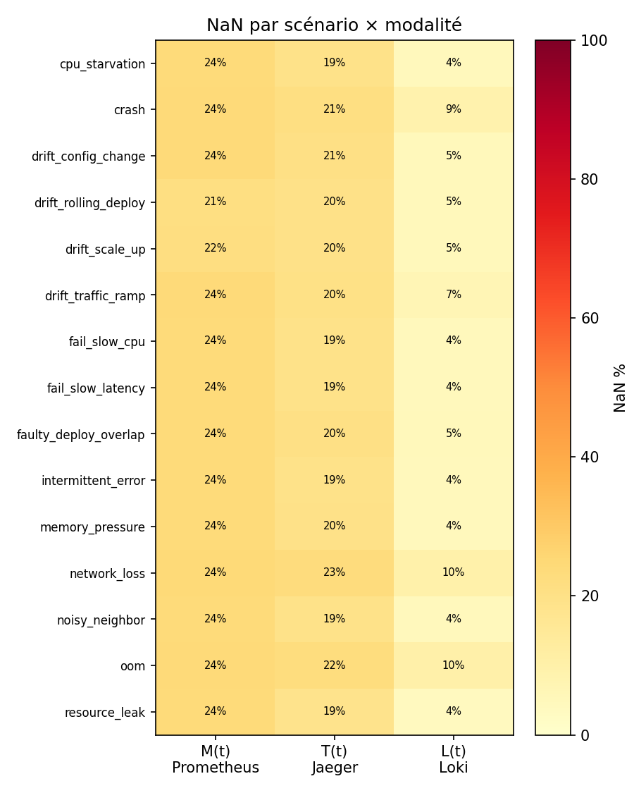

### 6.2.3 Défaut mesuré motivant l'itération suivante
Deux défauts mesurés motivent v4 : des épisodes trop courts (~21 pas), insuffisants pour la
confirmation temporelle du look-through (cause directe de l'échec H2a, §8.3), et le NaN structurel de
disk_io lié au nœud défaillant.

## 6.3 Itération ewat_v4 / ewat_v4_strat (épisodes longs, split stratifié)
▸ Raisonnement. **Observation** : les épisodes courts limitent la confirmation temporelle et certains
clusters manquent de positifs. **Hypothèse** : des épisodes deux fois plus longs et plus de
répétitions amélioreront les évaluations temporelles. **Action** : recollecte (T = 47–51 pas),
puis deux découpages. **Résultat** : signal pré-injection plus net (§8.7) mais H2a toujours en échec.
**Décision** : utiliser v4_strat pour les évaluations sur cible indépendante.

### 6.3.1 ewat_v4 — collecte 414 ép., 375 retenus, split temporel
La collecte v4 produit 414 épisodes, dont 375 retenus après filtre qualité (39 rejetés pour pannes
d'observabilité : coupures Loki et Jaeger). Le découpage temporel donne 262/56/57. La figure 2 illustre l'allongement des épisodes par rapport à ewat_v3.

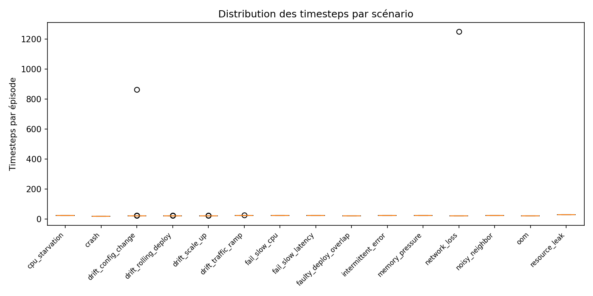

### 6.3.2 Motivation du split stratifié : 4 scénarios absents du train
Le split temporel d'ewat_v4 s'est révélé inutilisable pour les évaluations sur cible Chaos Mesh :
quatre scénarios (`faulty_deploy_overlap`, `memory_pressure`, `noisy_neighbor`, `resource_leak`)
étaient entièrement absents du train, rendant un test sur scénarios non vus trivialement à 0,5
d'AUROC. D'où la nécessité d'un découpage stratifié.

### 6.3.3 ewat_v4_strat — split 270/60/45 (≥ 1 ép./scénario/split)
Le dataset stratifié ewat_v4_strat (270/60/45) garantit au moins un épisode par scénario dans chaque
ensemble. C'est lui qui porte le headline défendable (§8.7) et la validation multi-graines (§9.3).

### 6.3.4 NaN résiduel par modalité
Le NaN résiduel de v4 est mieux réparti qu'en v3 : logs ≈ 2 %, métriques ≈ 3–5 %, traces ≈ 20–25 %
(reste structurel lié aux crashs, qui suppriment des spans).

## 6.4 Itération ewat_rcaeval — adaptation d'un benchmark externe
▸ Raisonnement. **Observation** : la validation externe est nulle, ce qui fragilise le pipeline.
**Hypothèse** : un benchmark public adapté au format EWAT permet un test de transfert honnête.
**Action** : convertir RCAEval RE2-OB. **Résultat** : détection d'anomalie générique oui, typage non
(§8.10). **Décision** : documenter l'échec et identifier le verrou (scaler), piste de travaux futurs.

### 6.4.1 Source RCAEval RE2-OB et conversion de format
`scripts/adapt_rcaeval.py` convertit le benchmark public RCAEval RE2-OB au format EWAT
(features compatibles v3). On obtient 90 épisodes couvrant 30 types de pannes, sur le même Online
Boutique mais un cluster Kubernetes différent.

### 6.4.2 Différences de protocole (cluster, 48 pas)
Les différences de protocole sont notables : cluster distinct et épisodes de 48 pas (contre ~21 pour
v3). Ces écarts pèsent sur le transfert zero-shot et few-shot analysé en §8.10.

## 6.5 Pivot ewat_v5 — Train Ticket (41 µservices Spring Cloud)
▸ Raisonnement. **Observation** : la topologie Online Boutique est trop petite (N = 6) et la cible
EWAT trop auto-référente (circularité de H3). **Hypothèse** : une application plus riche, avec de
vrais bugs documentés, donnera un dataset plus défendable et potentiellement public. **Action** :
pivoter vers Train Ticket (41 microservices Spring Cloud), enrichir le schéma et injecter des bugs
réels. **Résultat** : pipeline construit, vérifié end-to-end et durci. **Décision** : GO collecte sur
la VM.

### 6.5.1 Justification du pivot (richesse topologique, dataset public visé)
Train Ticket (FudanSELab, 41 microservices) offre une topologie bien plus profonde qu'Online
Boutique et, surtout, un catalogue de bugs réels documentés dans la littérature RCA. C'est aussi une
base ouverte, ce qui rend envisageable la publication d'un dataset public (sous réserve
d'autorisation Devoteam et d'assainissement des dumps).

### 6.5.2 Déploiement Train Ticket (tt / tt-b, mongo:4.4, jaeger:1.53, JVM)
L'application est déployée en deux instances parallèles (`tt`, `tt-b`), variante k8s-with-jaeger, avec
mongo:4.4 et jaeger:1.53, et l'agent JMX ajouté sans recompilation pour exposer les métriques JVM.

### 6.5.3 Schéma S(t) v5.1 = ℝ^{T×41×18} (18 features dont JVM)
Le schéma v5.1 passe à 18 features par nœud (ℝ^{T×41×18}), en enrichissant M de quatre features JVM
(ratio mémoire/limite, ratio de tas JVM, utilisation du GC, threads bloqués).

| Bloc | Features |
|---|---|
| M[0–9] | cpu, ram, latency_p99, error_rate, net, disk_io, mem_limit_ratio, jvm_heap_ratio, jvm_gc_util, jvm_threads_blocked |
| T[10–13] | abnormal_span_rate, trace_depth, fan_out, latency_cv |
| L[14–17] | log_error_rate, restart_count, semantic_anomaly (SBERT), lexical_entropy |

La feature initialement prévue `oom_events` (M[6]) a été remplacée par `mem_limit_ratio` : le cAdvisor
de ce cluster ne surface pas l'OOM (oom_events = 0 partout).

### 6.5.4 Catalogue chaos v5 (22 scénarios) et bugs réels F1/F3
Le catalogue v5 compte 22 scénarios (15 mono, 4 composites, 3 held-out) plus des bugs réels injectés
par échange d'image. Deux ressortent : F3 (OOM JVM/Docker) est un headline détectable
(restart_count + ram + tas), tandis que F1 (bug logique silencieux de type race) est un négatif
honnête : invisible en télémétrie — une « panne grise » au sens de GrayScope (§3.2.4.3).

### 6.5.5 Pipeline v5 séparé (run_campaign / build_features_v5 / validate_v5 / enforce_heldout_v5)
Le pipeline v5 est explicitement séparé en Record → Build → Assemble (`run_campaign` produit les
dumps ; `build_features_v5 --raw-root` reconstruit hors ligne ; `validate_v5`, `assemble_dataset
--stratified` et `enforce_heldout_v5` consolident), ce qui renforce l'immuabilité des dumps et la
reproductibilité.

### 6.5.6 Vérification data pré-lancement (6 épisodes réels)
Avant lancement, six épisodes réels ont été vérifiés de bout en bout : chaos localisé sur la cible
(CPU ×2,0), régimes propres, graphe G(t) dynamique, 0 NaN imputé, `validate` [OK], error_rate et
abnormal_span vivants, features JVM et sémantique actives. Deux bugs ont été corrigés à cette
occasion (restauration de F1, épinglage du contexte kubectl).

## 6.6 Tableau comparatif des versions de dataset
| Version | Topologie | N | T (pas) | #ép. retenus | Split | Défaut corrigé |
|---|---|---|---|---|---|---|
| ewat_v3 | Online Boutique | 6 | ~21 | 299 | 209/45/45 strat. | — (référence) |
| ewat_v4 | Online Boutique | 6 | 47–51 | 375 | 262/56/57 temp. | épisodes courts |
| ewat_v4_strat | Online Boutique | 6 | 47–51 | 375 | 270/60/45 strat. | scénarios absents du train |
| ewat_rcaeval | Online Boutique (autre cluster) | 6 | 48 | 90 | adapté | validation externe nulle |
| ewat_v5 | Train Ticket | 41 | 60 | ~720 (cible) | held-out enforced | N trop petit, circularité |

---

# 7 Architecture du pipeline EWAT et ses itérations
▸ Budget pages : 8
> RÈGLE ANTI-FUSION : chaque variante d'encodeur et chaque sweep a sa sous-section + ▸ Raisonnement.

## 7.1 Vue d'ensemble et modularité
Le pipeline est découpé en six modules indépendants et testables, sous `src/ewat/` : `drift` (étape 0),
`encoder` (étape 1), `typing` (étape 2), `ontology` (étape 2b), `precursor` (étape 3) et `alerts`
(assemblage). Chaque module a son interface, ses tests et peut être évalué isolément. Le signal S(t)
traverse les étapes 0 → 1 → 2 → 2b → 3 jusqu'à l'alerte typée (figure 3).

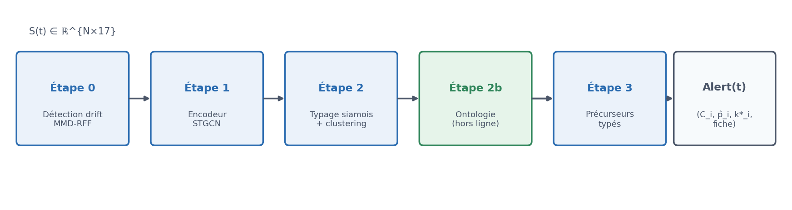

## 7.2 Étape 0 — Détection de drift MMD-RFF avec look-through
### 7.2.1 Test MMD² par Random Fourier Features (O(nD))
L'étape 0 compare la distribution de la fenêtre courante à une référence par la Maximum Mean
Discrepancy au carré (§3.3.2), approchée par Random Fourier Features. Cette approximation ramène le
coût à O(nD), compatible avec le budget de latence de l'étape (`src/ewat/drift/mmd.py`).

### 7.2.2 Mécanisme de look-through (transmettre / RECALIBRATE)
Le look-through gère trois cas. Si MMD² < ε_drift, le signal est transmis tel quel. Si MMD² ≥ ε_drift
avec confirmation post-drift positive, le signal est transmis avec un drapeau DRIFT (on « regarde au
travers » du drift sans annuler le signal). Si la confirmation est négative, on recalibre la référence
(W_ref ← W_cur). Le principe directeur est de ne jamais mettre le signal à zéro pendant un drift.

### 7.2.3 Calibration de ε_drift
▸ Raisonnement. **Observation** : le seuil de drift doit séparer un drift bénin d'une anomalie.
**Hypothèse** : un seuil de Youden sur des drifts bénins injectés sépare les deux régimes. **Action** :
injecter des drifts bénins et calibrer sur la courbe ROC. **Résultat** : ε_drift = 0,5226 (ROC-AUC
0,60). **Décision** : retenir ce seuil, tout en notant que l'AUC modérée préfigure l'échec de H2a.
La valeur calibrée est ε_drift = 0,5226 (cf. §8.2).

### 7.2.4 Intégration à l'AlertAssembler
Le DriftDetector est intégré à l'AlertAssembler (§7.9) : un drapeau de drift actif supprime les
alertes, ce qui réduit le taux de fausses alertes au point opérationnel (§8.11.3).

## 7.3 Représentation : graphe de services et tenseur d'adjacence
L'encodeur consomme le graphe sous forme du tenseur d'adjacence A(t) ∈ ℝ^{N×N×3} (§4.1.4),
construit par le `ServiceGraph` à partir des spans OTel. La convolution spatiale qui s'appuie dessus
reprend la formulation spectrale des GCN (§3.3.1.2), étendue aux trois canaux de poids.

## 7.4 Étape 1 — Encodeur STGCN (architecture de référence)
### 7.4.1 Couche GCN spectrale multi-canal + bloc temporel causal
L'encodeur de référence est un STGCN (§3.3.1.1) : une couche de convolution spectrale sur graphe à
trois canaux d'adjacence, suivie d'un bloc temporel convolutif causal (TCN dilaté) et d'une tête MLP
qui projette en un embedding z_e ∈ ℝ^{64} (`src/ewat/encoder/stgcn.py`). L'encodeur est pré-entraîné
par reconstruction auto-supervisée, sans labels de scénario.

### 7.4.2 LayerNorm et fix de forward (résidu TCN)
Un bug a été identifié et corrigé sur le passage forward : une normalisation LayerNorm appliquée au
résidu du TCN, activée après l'entraînement, modifiait silencieusement les sorties. Le forward a été
ramené au comportement d'entraînement, ce qui a légèrement amélioré les AUROC sans réentraînement.

### 7.4.3 EpisodeDataset, padding, instance normalization
La classe `EpisodeDataset` gère le chargement des épisodes de longueur variable, le padding (avec
masquage des positions paddées dans la moyenne temporelle) et la normalisation. La normalisation par
instance, quand elle est active, est strictement séparée du scaler global — un point corrigé lors de
l'audit (§8.7 montre son effet sur le signal pré-injection).

## 7.5 Itérations d'encodeur (variantes comparées)
### 7.5.1 STGCN — baseline retenue
▸ Raisonnement. **Observation** : il faut un encodeur de référence stable. **Hypothèse** : le STGCN
suffit à structurer les types. **Action** : entraîner et évaluer (K = 10). **Résultat** : H1 PASS
(sil_test 0,414), 8/10 types prédictibles. **Décision** : retenir le STGCN comme architecture
principale, plus stable et disponible en multi-graines. Détails chiffrés en §8.11.1.

### 7.5.2 SimCLR — pré-entraînement contrastif (NT-Xent)
▸ Raisonnement. **Observation** : un meilleur pré-entraînement pourrait améliorer la prédictibilité.
**Hypothèse** : un pré-entraînement contrastif NT-Xent (§3.3.1.4) sur augmentations temporelles
(§3.3.1.5) renforce les représentations. **Action** : pré-entraîner le même encodeur en SimCLR avant
le fine-tuning siamois. **Résultat** : K = 15, sil_test 0,429, AUROC moyen 0,964 (meilleur des trois),
mais 4 types non concluants (clusters trop petits). **Décision** : variante prometteuse, à confirmer
sur v4.

### 7.5.3 GAT — attention sur arêtes
▸ Raisonnement. **Observation** : l'adjacence pondérée pourrait gagner à être apprise. **Hypothèse** :
remplacer les couches GCN par de l'attention (§3.3.1.3) améliore la géométrie. **Action** : entraîner
un encodeur GAT à interface identique. **Résultat** : K = 15, sil_test 0,497 (meilleure géométrie,
+0,083 vs STGCN), 13/15 types, mais AUROC moyen plus faible (0,929). **Décision** : l'attention aide
H1 et nuit à H3 ; non retenue comme défaut, conservée comme comparaison.

### 7.5.4 Tableau comparatif des trois encodeurs
| Architecture | K | sil_val | sil_test | H1 | #types | AUROC moyen |
|---|---|---|---|---|---|---|
| STGCN (référence) | 10 | 0,470 | 0,414 | ✓ | 8/10 | 0,954 |
| SimCLR | 15 | 0,495 | 0,429 | ✓ | 11/15 | 0,964 |
| GAT | 15 | 0,445 | 0,497 | ✓ | 13/15 | 0,929 |

## 7.6 Étape 2 — Typage contrastif et clustering
### 7.6.1 Réseau siamois (perte contrastive, mining)
Le typage entraîne un réseau siamois (`src/ewat/typing/`) : l'encodeur suivi d'une tête de projection
L2-normalisée, optimisé par une perte contrastive qui rapproche les paires de même scénario Chaos
Mesh et éloigne les autres, avec sélection des négatifs (mining). Un clustering hiérarchique
agglomératif sur les embeddings train produit les types ; val et test sont assignés par nearest
centroid (§8.1.1).

### 7.6.2 Sweep clustering : ward+euclidean → average+cosine
▸ Raisonnement. **Observation** : la silhouette plafonne avec le clustering initial (Ward +
euclidien). **Hypothèse** : ce choix est géométriquement incohérent avec des embeddings L2-normalisés
sur la sphère unité (§3.3.6.5). **Action** : balayer linkage × métrique. **Résultat** : average +
cosinus l'emporte nettement. **Décision** : adopter average + cosinus, à l'origine du gain de H1.
Ce changement fait passer la silhouette moyenne de 0,519 ± 0,092 à 0,782 ± 0,065 (§8.4.2).

### 7.6.3 Sweep projection siamoise : d_proj × margin
▸ Raisonnement. **Observation** : la dimension de projection et la marge influencent la séparation.
**Hypothèse** : un balayage d_proj × marge trouve un meilleur compromis. **Action** : 36 runs
(d_proj ∈ {32, 64, 128} × marge ∈ {0,5 ; 1,0 ; 1,5 ; 2,0} × 3 graines). **Résultat** : dp64_m2.0
maximise H1, dp32_m1.5 maximise H3. **Décision** : retenir dp64_m2.0 (priorité à la structurabilité,
contribution principale).

### 7.6.4 Sélection de K (silhouette vs gap statistic)
Le nombre de clusters K est choisi par la silhouette sur le train (`cluster_embeddings`), avec la
statistique de gap (§3.2.5.2) comme second estimateur. Les deux divergent et aucun ne stabilise K,
ce qui constitue une limite analysée en §9.4–§9.5.

### 7.6.5 Interprétabilité : permutation importance + validation KernelSHAP
Les fiches de type donnent l'importance des features par cluster. La méthode initiale (gradient ×
input) s'est révélée non fiable : sa corrélation de Spearman avec l'importance par permutation est de
−0,34 (anti-corrélée), donc invalidée. Les fiches ont été régénérées par importance de permutation,
puis validées par KernelSHAP (§3.3.4) : la concordance est positive pour 9 clusters sur 10. La figure 4 montre l'alignement entre clusters appris et scénarios Chaos Mesh.

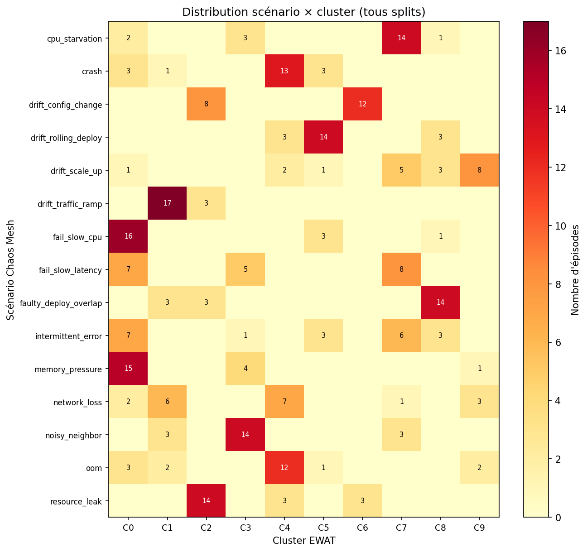

## 7.7 Reframing architectural — cible Chaos Mesh directe
Ce reframing est né du constat de circularité (§8.6) : pour obtenir un chiffre défendable, on évalue
directement sur la cible indépendante Chaos Mesh. Les résultats chiffrés sont en §8.7–§8.8 ; on
expose ici la logique de conception.

### 7.7.1 B1 — diagnostic instance normalization (global vs instance)
▸ Raisonnement. **Observation** : les baselines absolues des services brouillent peut-être le signal.
**Hypothèse** : une normalisation par instance révèle mieux la dynamique pré-injection. **Action** :
diagnostic position × mode de normalisation, sur features brutes. **Résultat** : l'instance norm
améliore la séparation et révèle un écart far/near non nul. **Décision** : intégrer l'instance norm
à l'architecture v2.

### 7.7.2 B2 — LR-OvR sur features brutes flatten (headline défendable)
▸ Raisonnement. **Observation** : il faut un modèle prédictif sans circularité. **Hypothèse** : une
régression logistique one-vs-rest sur features brutes aplaties suffit sur la cible Chaos Mesh.
**Action** : entraîner B2 sur ewat_v4_strat. **Résultat** : macro-AUROC 0,920 (IC [0,878 ; 0,956]).
**Décision** : c'est le headline défendable du rapport.

### 7.7.3 C1 — STGCN end-to-end sur cible Chaos Mesh (n'aide pas)
▸ Raisonnement. **Observation** : peut-être le STGCN aide-t-il sur cible indépendante. **Hypothèse** :
un STGCN entraîné de bout en bout sur Chaos Mesh dépasse B2. **Action** : l'entraîner avec instance
norm. **Résultat** : 0,863, en deçà de B2 (0,920). **Décision** : exclure le STGCN de la chaîne
prédictive principale ; le conserver pour le typage et l'ontologie.

### 7.7.4 Pipeline opérationnel résultant (Option B, sans STGCN prédictif)
La chaîne opérationnelle se simplifie donc en : S(t) → instance norm → régression logistique
one-vs-rest → softmax → OpenMax (pour le signal de nouveauté). Le STGCN reste utile en amont pour
structurer l'espace latent (H1) et alimenter l'ontologie, mais n'est pas sur le chemin prédictif
(figure 5).

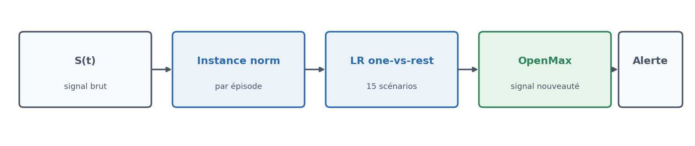

## 7.8 Étape 3 — Précurseurs typés
### 7.8.1 Classifieurs one-vs-rest et sélection de k*
L'étape 3 entraîne un classifieur binaire par type (one-vs-rest, `src/ewat/precursor/`) qui estime la
probabilité qu'une anomalie de ce type se développe à un horizon k. L'horizon optimal k* est
sélectionné sur la validation, l'AUROC reporté sur le test (§8.1.1).

### 7.8.2 Sweep classifieur précurseur (lr / lr_tuned / rf / svc)
▸ Raisonnement. **Observation** : le choix du classifieur peut influer sur H3. **Hypothèse** : un
modèle réglé (régression logistique avec recherche de C) fait mieux. **Action** : balayer {lr,
lr_tuned, rf}. **Résultat** : les trois sont très proches (lr_tuned marginalement meilleur).
**Décision** : retenir lr_tuned, en notant que la tâche est peu sensible au classifieur.

## 7.9 Étape 0→3 — Assemblage des alertes
L'`AlertAssembler` (`src/ewat/alerts/`) assemble la sortie finale : il regroupe les passages encodeur
par horizon, applique les classifieurs de précurseurs, intègre le drapeau de drift (qui supprime les
alertes en cas de drift bénin) et produit l'alerte typée Alert(t) = (C_i, p̂_i(t), k*_i, fiche). Son
évaluation en ligne (§8.11.3) fixe le point opérationnel au seuil 0,70.

---

# 8 Expérimentations, hypothèses et résultats
▸ Budget pages : 11

Ce chapitre rassemble les résultats du pipeline, organisés par hypothèse. Un principe gouverne sa
lecture : on sépare systématiquement les chiffres obtenus sur une cible **indépendante** — les
labels d'injection Chaos Mesh, qui constituent une vérité terrain extérieure au pipeline (§8.7,
§8.8) — de ceux obtenus sur une cible **auto-référente**, c'est-à-dire les clusters produits par
EWAT lui-même (§8.6). Les premiers se défendent tels quels ; les seconds mesurent la cohérence
interne du pipeline et doivent être lus avec la mise en garde de circularité. Sauf mention
contraire, les résultats portent sur ewat_v3 (split 209/45/45) ; les évaluations sur cible
indépendante utilisent ewat_v4_strat (270/60/45).

## 8.1 Protocole d'évaluation et corrections méthodologiques
### 8.1.1 Held-out, nearest centroid (H1), k* sur val (H3)
Une relecture méthodologique (mai 2026) a révélé deux biais dans les scripts d'origine, corrigés
dans tous les résultats rapportés ici. Premièrement, la silhouette de validation et de test était
calculée par un clustering indépendant sur chaque split (`fit_predict`), ce qui trouve la meilleure
partition propre à chaque ensemble et surestime la structurabilité. On la calcule désormais en
assignant les points de val et de test au plus proche centroïde des clusters *train*
(« nearest centroid »), ce qui mesure une vraie généralisation. L'accord entre cette méthode et un
clustering indépendant sur le train atteint 97,6 %, ce qui valide la cohérence de l'assignation.
Deuxièmement, l'horizon optimal $k^*$ des précurseurs était sélectionné directement sur le test ;
il l'est maintenant sur la validation, l'AUROC n'étant rapporté que sur le test.
▸ Source : docs/evaluation_protocol.md, experiments/verification/.

### 8.1.2 Bootstrap et intervalles de confiance (BCa)
Les métriques scalaires — AUROC, silhouette, proportions — sont accompagnées d'un intervalle de
confiance à 95 % obtenu par bootstrap (1000 rééchantillonnages), avec la correction BCa
(biais-corrigé et accéléré) lorsqu'elle s'applique. Cela rend explicite l'incertitude liée à la
petite taille des ensembles de test (45 épisodes). ▸ lien Efron §3.3.6.1.

## 8.2 Calibration de l'étape 0 (drift)
Le seuil de drift est calibré épisode par épisode : on calcule un MMD² unique entre une fenêtre de
référence (5 premiers pas, régime normal) et une fenêtre courante (5 derniers pas, régime chaos),
puis on retient le seuil de Youden sur la courbe ROC. On obtient $\varepsilon_{drift} = 0{,}5226$,
pour une ROC-AUC de 0,60 (TPR = 0,55, FPR = 0,33 sur le train). L'AUC modérée annonce déjà la
difficulté de séparer drift et anomalie par ce seul mécanisme, confirmée en §8.3 (figure 6).

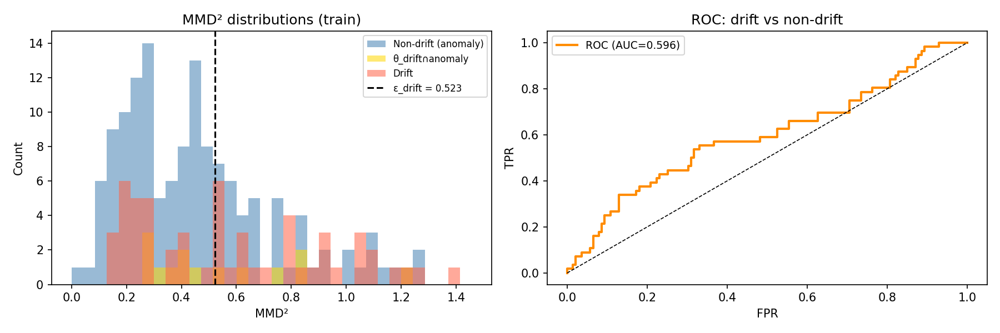

## 8.3 Résultat H2a — séparabilité du drift par look-through (résultat négatif)
▸ Raisonnement. **Observation** : en production, déploiements et autoscaling produisent des
changements de distribution qui ressemblent à des anomalies. **Hypothèse H2a** : le mécanisme de
look-through (confirmation temporelle post-drift) réduit le taux de faux positifs à rappel constant.
**Action** : comparer le DriftDetector à un seuil MMD² simple, en streaming sur le test.
**Résultat** : aucune réduction significative (détails ci-dessous). **Décision** : conserver
l'étape 0 comme alarme de changement rapide, mais confier la qualification drift/anomalie aux
étapes aval — les deux ne sont pas substituables.

### 8.3.1 Look-through sur signal brut
Sur les 45 épisodes de test, le look-through dégrade plutôt qu'il n'améliore la séparation : il
détecte correctement 42 % des drifts comme drifts (contre 67 % pour le seuil simple) et confond
67 % des anomalies avec un drift (contre 73 %). La réduction du taux de faux positifs n'est pas
significative (test de Student unilatéral apparié, p = 0,27).

| | Look-through | Seuil simple |
|---|---|---|
| TPR (drift détecté comme drift) | 0,42 | 0,67 |
| FPR (anomalie confondue avec drift) | 0,67 | 0,73 |
| p-value (Student unilatéral apparié) | 0,27 | — |

### 8.3.2 Look-through sur embeddings STGCN
Rejouer le test dans l'espace d'embedding du typage (au lieu du signal brut) ne change rien :
le seuil de Youden y vaut $\varepsilon_{emb} = 0{,}5186$ pour un indice J de seulement 0,071
(discrimination quasi nulle), et le look-through reste pire que le seuil simple (FPR 0,788 contre
0,667, p = 0,978). Les embeddings siamois capturent *quel type* d'anomalie se produit, pas *si* le
changement en cours est un drift bénin ou une anomalie.

### 8.3.3 Retest sur ewat_v4_strat (épisodes longs)
On pouvait soupçonner que l'échec venait de la brièveté des épisodes v3 (~21 pas). Le retest sur
ewat_v4_strat (épisodes de 47 à 51 pas) donne le même verdict : TPR 0,500 contre 0,750 pour le
seuil simple, réduction du FPR non significative (p = 0,372). La durée n'explique donc pas tout.

### 8.3.4 Interprétation : H2a FAIL robuste (contribution négative honnête)
H2a est falsifiée, et de façon reproductible (v3 et v4_strat). C'est un résultat négatif assumé :
le MMD² avec confirmation temporelle ne sépare pas le drift bénin de l'anomalie sur ce type de
données. Loin d'invalider l'architecture, ce constat la précise — l'étape 0 sert d'alarme de
changement, la distinction de régime relève d'un espace de représentation dédié qui reste à
construire (piste de travaux futurs, §12).

## 8.4 Résultat H1 — structurabilité des embeddings
▸ Raisonnement. **Observation** : si les types d'anomalies existent réellement, les embeddings
doivent se regrouper. **Hypothèse H1** : la silhouette en held-out dépasse 0,3 (seuil de Kaufman &
Rousseeuw). **Action** : entraîner l'encodeur puis le typage siamois, mesurer la silhouette par
nearest centroid. **Résultat** : seuil franchi, avec un net gain après optimisation du clustering.
**Décision** : H1 retenue comme contribution géométrique principale du pipeline.

### 8.4.1 Silhouette train/val/test, K optimal
Sur ewat_v3 (graine 42), la silhouette vaut 0,577 (train), 0,470 (val) et 0,414 (test), pour un
nombre optimal de clusters K = 10. Le test à 0,414 dépasse largement le seuil de 0,3 : **H1 ✓ PASS**.
Que K = 10 émerge de 15 scénarios injectés signifie que certains scénarios partagent une même
signature dans l'espace latent (par exemple un crash et un OOM peuvent être indiscernables une
minute avant l'événement) — le pipeline découvre une taxonomie plus compacte que le catalogue
Chaos Mesh.

| Split | Silhouette | Méthode |
|---|---|---|
| Train | 0,577 | clustering agglomératif |
| Val | 0,470 | nearest centroid |
| Test | 0,414 | nearest centroid |

### 8.4.2 Config optimisée (average+cosine, d_proj=64, m=2.0)
Un sweep d'hyperparamètres (détaillé en §7.6) fait passer la silhouette test de 0,519 ± 0,092
(config initiale, 5 graines) à **0,782 ± 0,065** (10 graines), avec un minimum de 0,618 — toujours
au-dessus du seuil. Ce gain de +51 % est réel et défendable : il vient de l'alignement géométrique
entre la métrique de clustering (cosinus sur sphère unité) et les embeddings L2-normalisés, et non
d'un ajustement sur les labels. Sur le dataset plus long ewat_v4_strat (Phase H, 10 graines), la
silhouette retombe à 0,691 ± 0,115 avec une variance plus large (intervalle [0,521 ; 0,839]) — la
structurabilité tient, mais K devient instable (§9.5).

## 8.5 Résultat H2b — identification du régime θ_{drift∩anomaly} (nuancé)
▸ Raisonnement. **Observation** : le régime mixte θ_{drift∩anomaly} (déploiement défectueux) doit
se distinguer du drift pur et de l'anomalie pure. **Hypothèse H2b** : un cluster présente
simultanément drift et alerte à une fréquence supérieure au hasard. **Action** : mesurer le
chevauchement par cluster, puis tester sa significativité. **Résultat** : PASS formel mais trivial.
**Décision** : reconnaître la limite (DriftDetector trop sensible sur épisodes courts) plutôt que
de la masquer.

### 8.5.1 Critère formel (overlap > 30 %) — PASS trivial
Le critère « chevauchement > 30 % » est atteint partout, mais pour une mauvaise raison : sur des
épisodes courts, le DriftDetector (fenêtre de 5 pas) se déclenche sur presque tous les épisodes, et
le seuil d'alerte tire sur la plupart. Le cluster C8 (faulty_deploy_overlap), censé incarner le
régime mixte, affiche bien drift% = 0,85, alert% = 0,92 et overlap% = 0,77 — cohérent — mais sans se
détacher nettement des autres.

### 8.5.2 Critère strict (Fisher exact C8 vs drift pur)
Le test strict confirme la trivialité : un test exact de Fisher comparant C8 aux clusters de drift
pur (C5+C6+C9) donne un odds ratio de 1,48 et p = 0,35, soit aucune différence significative. Le
critère formel passe, mais le régime mixte n'est pas isolé de façon robuste.

### 8.5.3 Timing : alerte précurseur avant drift flag
Un constat complémentaire éclaire l'architecture : l'alerte de précurseur précède le drapeau de
drift dans 85 à 100 % des cas. Le DriftDetector est donc un indicateur *tardif* ; l'anticipation
réelle vient de l'étape 3 (précurseurs), pas de l'étape 0. H2b renforce ainsi la conclusion de H2a.

## 8.6 Résultat H3 — prédictibilité des précurseurs (cible EWAT, CIRCULAIRE)
> ⚠ **Mise en garde de circularité.** Les chiffres de cette section mesurent la prédiction des
> labels de cluster produits par EWAT lui-même à partir des embeddings STGCN : la cible est
> auto-référente. Ils établissent la cohérence interne du pipeline, non sa valeur prédictive
> indépendante. Le chiffre défendable correspondant est en §8.7 ; le test de précursion temporelle
> qui démasque cette circularité est en §9.1.1.

▸ Raisonnement. **Observation** : si les embeddings capturent des signaux pré-anomalie, on doit
prédire le type avant l'injection. **Hypothèse H3** : l'AUROC par type dépasse la base 0,5.
**Action** : un classifieur one-vs-rest par cluster, $k^*$ choisi sur val, AUROC sur test.
**Résultat** : 8/10 types prédictibles. **Décision** : H3 PASS, mais à recadrer (cf. §9.1).

### 8.6.1 AUROC par type, k*, IC bootstrap (ewat_v3)
| Type | n_pos test | k* | AUROC test | IC 95 % |
|---|---|---|---|---|
| C0 | 8 | 6 | 0,973 | [0,906 ; 1,000] |
| C1 | 3 | 6 | 0,992 | [0,953 ; 1,000] |
| C2 | 5 | 6 | 0,945 | [0,865 ; 1,000] |
| C3 | 3 | 2 | 0,794 | [0,636 ; 0,930] |
| C4 | 8 | 2 | 1,000 | [1,000 ; 1,000] |
| C5 | 2 | 6 | 0,977 | [0,909 ; 1,000] |
| C6 | 1 | 2 | NaN (n_pos < 2) | — |
| C7 | 7 | 6 | 0,992 | [0,966 ; 1,000] |
| C8 | 7 | 10 | 0,962 | [0,895 ; 1,000] |
| C9 | 1 | 2 | NaN (n_pos < 2) | — |

L'horizon $k^* = 6$ pas (3 min) domine (5 types sur 8), ce qui situe la zone de prédictibilité
optimale autour de 3 minutes. C6 et C9 sont non concluants faute de positifs en test (figure 7).

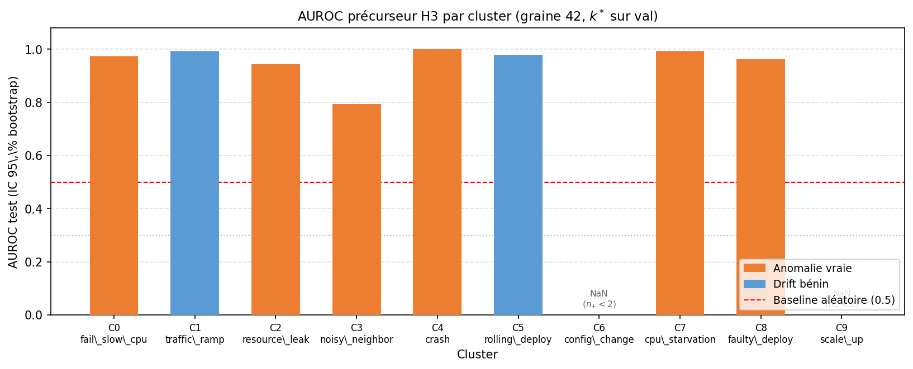

### 8.6.2 Verdict H3 PASS et mise en garde de circularité
H3 est validée au sens « AUROC > 0,5 » : 8/10 types ont un AUROC supérieur à 0,9, et la config
optimisée porte la moyenne à 0,987 ± 0,011 (10 graines, 10/10 PASS). Mais cette performance mesure
la *récupérabilité* des labels EWAT, pas une prédiction d'événement futur indépendante : le test
distant-window (§9.1.1) montre que l'AUROC ne dépend pas de la position de la fenêtre dans le régime
normal. On reformule donc H3 en « typage anticipé du scénario actif » plutôt qu'en « détection
précoce », et l'on s'appuie sur §8.7 pour le chiffre défendable.

## 8.7 Headline défendable — cible Chaos Mesh indépendante (B1/B2)
> ⚠ **Chiffres défendables.** Cible indépendante (labels d'injection Chaos Mesh), intervalles de
> confiance explicites, sans encodeur appris sur la cible. C'est le résultat à mettre en avant.

### 8.7.1 B1 — instance norm, position de fenêtre (v3 puis v4_strat)
Un diagnostic sur features brutes (sans encodeur) compare la normalisation globale à la
normalisation par instance, et fait varier la position de la fenêtre dans le régime normal. Deux
enseignements. D'abord, la normalisation par instance améliore la séparation des scénarios, car elle
gomme les baselines absolues propres à chaque service. Ensuite, l'écart entre une fenêtre proche de
l'injection et une fenêtre lointaine — $\Delta(\text{far}-\text{near})$ — est négatif : il existe
une dynamique pré-injection captée par le signal. Sur ewat_v3, $\Delta = -0{,}071$ (global) et
$-0{,}026$ (instance) ; sur ewat_v4_strat, $-0{,}043$ et $-0{,}063$, plus marqué grâce aux épisodes
deux fois plus longs.

### 8.7.2 B2 — LR-OvR flatten, macro-AUROC stratified + LOSO
Le headline défendable est une régression logistique one-vs-rest sur les features brutes aplaties
(fenêtre pré-injection, instance-normalisées), sans encodeur STGCN, entraînée à prédire les
15 scénarios Chaos Mesh. Sur ewat_v4_strat, elle atteint un macro-AUROC **stratifié de 0,9201**
(IC 95 % [0,878 ; 0,956]) et **0,9298 en validation croisée leave-one-scenario-out** (15 folds).
Le solveur lbfgs étant déterministe, la valeur ne varie pas d'une graine à l'autre ; seule
l'incertitude bootstrap est rapportée.

### 8.7.3 Comparaison v3 vs v4_strat (amplification du signal)
| Métrique | ewat_v3 | ewat_v4_strat |
|---|---|---|
| B2 stratifié | 0,855 [0,789 ; 0,905] | **0,920** [0,878 ; 0,956] |
| B2 LOSO | 0,847 | **0,930** |
| B1 best (instance norm, fenêtre proche) | 0,850 | **0,941** [0,909 ; 0,970] |

Les épisodes plus longs de v4 confirment et amplifient le signal de v3 : la dynamique pré-injection
y est plus nette.

## 8.8 Neutralité de l'encodeur STGCN sur cible indépendante (B3/B4, C1)
### 8.8.1 B3/B4 — features brutes vs z_e STGCN (macro-AUROC, k=6)
Sur la cible indépendante, ajouter l'encodeur STGCN n'améliore pas la prédiction agrégée : les
features brutes (B3) et les embeddings STGCN (B4) donnent exactement le même macro-AUROC de 0,835
($\Delta_{macro} = 0{,}000$ sur ewat_v3). Le détail par scénario montre que l'encodeur *redistribue*
la discriminabilité plutôt qu'il ne l'augmente — il aide les pannes de saturation CPU/latence
(fail_slow_cpu +0,270) et nuit aux pannes réseau/config (noisy_neighbor −0,246), la somme des écarts
étant exactement nulle sur n = 45.

### 8.8.2 A5 — IC paired bootstrap sur Δ(B4−B3)
Ce $\Delta = 0$ n'est pas un artefact ponctuel : un bootstrap apparié (mêmes indices pour B3 et B4,
1000 tirages) donne $\Delta(B4-B3) = +0{,}0053$ avec un IC 95 % de [−0,0315 ; +0,0444], qui contient
zéro (P($\Delta \le 0$) = 0,420). La neutralité de l'encodeur sur cette cible est donc statistiquement
bien établie.

### 8.8.3 C1 — STGCN end-to-end ne dépasse pas B2
Entraîner un STGCN de bout en bout directement sur la cible Chaos Mesh (v4_strat) ne renverse pas le
constat : il plafonne à 0,863 (IC [0,823 ; 0,905]), en deçà des 0,920 de la régression logistique B2.
L'encodeur n'est pas nécessaire à la tâche prédictive principale.

### 8.8.4 Interprétation : valeur géométrique/ontologique, pas prédictive agrégée
La valeur du STGCN n'est donc pas dans la prédiction agrégée mais ailleurs : dans la structuration de
l'espace latent (H1, silhouette 0,782) qui rend le clustering et l'ontologie possibles, et dans la
précursion temporelle qu'il exploite sur cible indépendante (§9.1.6). Le pipeline opérationnel met
en avant la régression logistique ; le STGCN sert le typage et l'ontologie.

## 8.9 Baselines précurseurs (B0–B4)
Deux familles de baselines coexistent, selon la cible. B0–B2 visent les labels EWAT (mesure de
*récupérabilité*, donc circulaire) ; B3–B4 visent les labels Chaos Mesh (vérité terrain
indépendante, défendable). Les valeurs B3/B4 sont reprises de §8.8.

### 8.9.1 B0 — aléatoire (référence 0,5)
Classifieur aléatoire, AUROC 0,500 — borne basse de référence.

### 8.9.2 B1 — features brutes (cible EWAT, récupérabilité)
Régression logistique sur features brutes prédisant les labels EWAT : AUROC 0,966. Les labels EWAT
sont donc trivialement récupérables sans encodeur — premier indice de circularité.

### 8.9.3 B2 — k-means brut + LR (cible EWAT)
Un k-means brut suivi d'une régression logistique atteint 0,975, soit davantage que le pipeline
EWAT complet (0,951) sur sa propre cible. Confirmation que cette tâche ne nécessite pas le STGCN.

### 8.9.4 B3 — features brutes (cible Chaos Mesh indépendante)
Sur la vérité terrain Chaos Mesh, les features brutes donnent 0,835 (IC [0,773 ; 0,888]).

### 8.9.5 B4 — STGCN z_e (cible Chaos Mesh)
Les embeddings STGCN donnent également 0,835 (IC [0,772 ; 0,885]) — voir §8.8 pour l'analyse de la
neutralité.

### 8.9.6 Lecture : récupérabilité (circulaire) vs vérité terrain (défendable)
B1/B2 mesurent à quel point les labels EWAT se reconstituent depuis le signal (circulaire) ; B3/B4
mesurent une vraie discriminabilité de scénario (défendable). L'écart entre les deux familles
(0,97 vs 0,84) chiffre exactement la part de circularité à retrancher du « headline » naïf.

## 8.10 Transfert externe — ewat_rcaeval
▸ Raisonnement. **Observation** : la validation externe est nécessaire pour crédibiliser le
pipeline. **Hypothèse** : appliqué sans réentraînement à un benchmark public (RCAEval RE2-OB), le
pipeline conserve H1/H3. **Action** : transfert zero-shot puis few-shot. **Résultat** : détection
d'anomalie générique oui, discrimination par type non. **Décision** : reconnaître l'échec et
identifier le verrou (le scaler).

### 8.10.1 Zero-shot (4 stratégies de normalisation)
Appliqué tel quel à RCAEval (90 épisodes, 30 types de pannes), le pipeline regroupe les anomalies
mais ne les discrimine pas. La meilleure configuration (instance norm + métriques seules) atteint une
silhouette H1 de 0,684 (PASS) mais un AUROC H3 de 0,495 (échec, ≈ hasard) : l'encodeur détecte
qu'il y a une anomalie, sans dire laquelle.

### 8.10.2 Few-shot Stratégie A (re-fit scaler)
Réajuster le seul scaler sur quelques épisodes RCAEval ne débloque rien : l'AUROC H3 reste collé à
≈ 0,50 quel que soit le nombre d'épisodes (de 1 à 40) (figure 8).

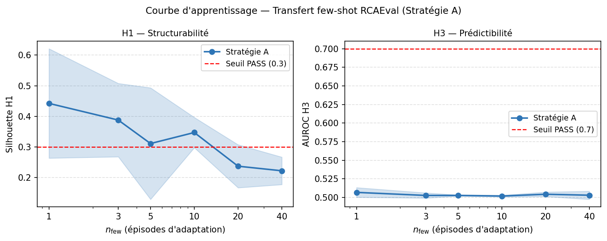

### 8.10.3 Interprétation : goulot = scaler non transférable (échec honnête)
Le verrou est l'espace latent ewat_v3, qui ne sépare pas les types RCAEval ; réajuster le scaler est
insuffisant. Un transfert réel demanderait un fine-tuning du classifieur ou de l'encodeur
(Stratégie B, §12). C'est un échec de généralisation assumé, utile car il borne la portée du modèle.

## 8.11 Comparaison des encodeurs et baseline d'alerte
### 8.11.1 STGCN vs SimCLR vs GAT (récapitulatif chiffré)
| Architecture | K | sil_val | sil_test | H3 types | AUROC moyen |
|---|---|---|---|---|---|
| STGCN (référence) | 10 | 0,470 | 0,414 | 8/10 | 0,954 |
| SimCLR (contrastif) | 15 | 0,495 | 0,429 | 11/15 | 0,964 |
| GAT (attention) | 15 | 0,445 | 0,497 | 13/15 | 0,929 |

GAT offre la meilleure géométrie (sil_test 0,497) et couvre plus de types, mais avec un AUROC moyen
plus faible ; SimCLR maximise l'AUROC ; STGCN, avec K = 10 plus stable et des résultats multi-graines
disponibles, est retenu comme architecture principale (cf. §7.5).

### 8.11.2 Baseline z-score vs EWAT (détection, FA drift, lead time)
La baseline z-score détecte 100 % des anomalies mais lève 100 % de fausses alertes sur les drifts,
quel que soit le seuil σ — elle ne distingue pas drift et anomalie. C'est exactement le faux positif
que EWAT vise à éliminer.

| Méthode | Détection | FA drift | Lead (min) |
|---|---|---|---|
| z-score (σ = 2,0–3,5) | 100 % | 100 % | 2,5 |
| EWAT (seuil 0,7) | 57,6 % | 8,3 % | 3,0 |

### 8.11.3 Simulation en ligne AlertAssembler (seuils)
| Seuil | Détection | Cluster correct | FA drift | Lead (min) |
|---|---|---|---|---|
| 0,30 | 100 % | 42,4 % | 100 % | 4,6 |
| 0,40 | 97,0 % | 66,7 % | 100 % | 3,8 |
| 0,50 | 78,8 % | 63,6 % | 100 % | 3,9 |
| 0,60 | 75,8 % | 63,6 % | 50,0 % | 3,7 |
| 0,70 | 57,6 % | 51,5 % | 8,3 % | 3,0 |

Le point opérationnel recommandé est le seuil 0,70 : il ramène le taux de fausses alertes sur drift à
8,3 % tout en conservant un lead time de 3,0 min. Aux seuils bas, le DriftDetector n'a pas le temps de
se réchauffer avant que les classifieurs ne tirent (limite liée à la longueur des épisodes). Les figures 9 et 10 détaillent le compromis détection/fausses alertes et l'attribution de cluster.

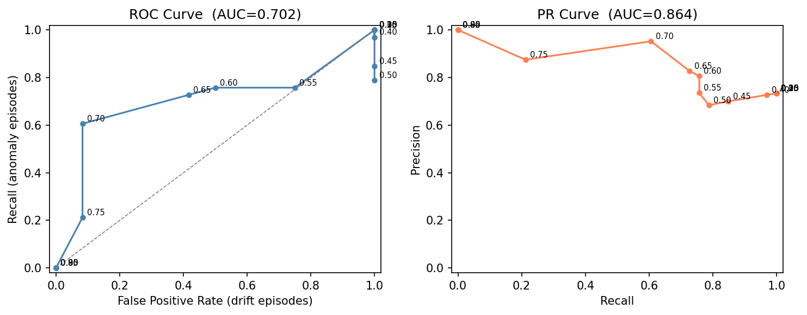

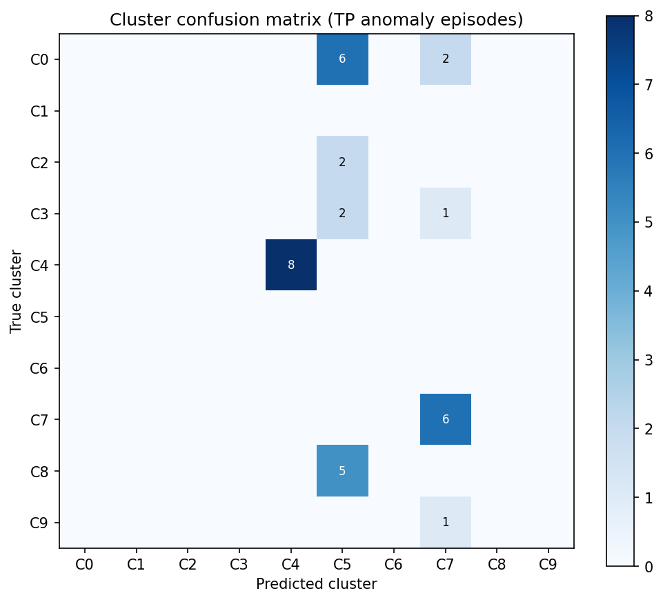

## 8.12 Ablations
### 8.12.1 Ablation modalités H1 (réentraînement complet)
Cette ablation réentraîne entièrement l'encodeur et le typage pour chaque combinaison de modalités
(et non un simple masquage à l'inférence, qui serait biaisé hors-distribution). Résultat
contre-intuitif : les **métriques seules battent le modèle complet** (silhouette test 0,497 contre
0,439, soit +0,058). Les traces et les logs ajoutent du bruit géométrique au clustering sur
n = 209 — leur valeur est prédictive (H3), pas géométrique (H1).

| Condition | n_feat | sil_train | sil_test | Δ vs full |
|---|---|---|---|---|
| full | 17 | 0,378 | 0,439 | — |
| M_only | 7 | 0,241 | **0,497** | +0,058 |
| T_only | 6 | 0,064 | 0,412 | −0,027 |
| M+L | 11 | 0,251 | 0,382 | −0,057 |
| T+L | 10 | 0,022 | 0,341 | −0,098 |
| M+T | 13 | 0,318 | 0,316 | −0,123 |
| L_only | 4 | −0,138 | 0,051 | −0,388 |

### 8.12.2 Ablation modalités H3 (masquage inférence)
Pour la prédictibilité, la conclusion s'inverse : le modèle complet (macro-AUROC 0,954) bat toutes
les réductions. Traces et logs sont nécessaires aux précurseurs même s'ils nuisent au clustering (figure 11).

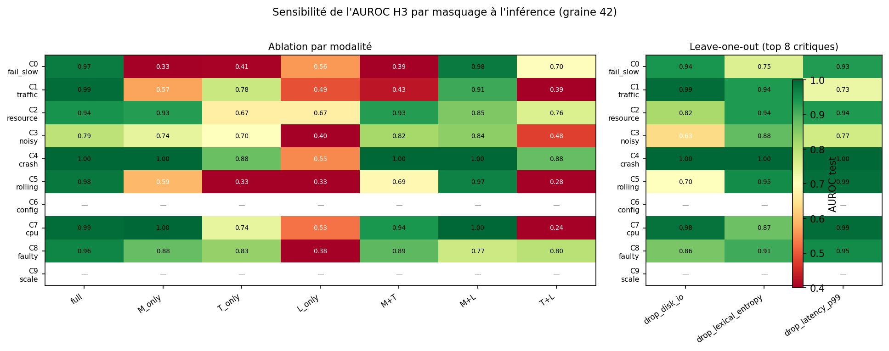

| Condition | Macro-AUROC | Δ vs full |
|---|---|---|
| full | 0,954 | — |
| M+L | 0,916 | −0,038 |
| M_only | 0,756 | −0,198 |
| T+L | 0,563 | −0,391 |
| L_only | 0,488 | −0,466 |

### 8.12.3 Ablation par feature (leave-one-out) et redondance
En retirant une feature à la fois (test de Wilcoxon signé, p < 0,05), les plus critiques pour H1 sont
`trace_depth` (Δ = −0,069), `lexical_entropy` (−0,069) et `latency_p99` (−0,062) ; `disk_io` reste
significatif malgré ses 16,7 % de NaN (−0,010), ce qui plaide pour ewat_v4. Pour H3, la feature la
plus critique est `disk_io` (Δ = −0,088). Deux paires sont fortement redondantes :
`latency_p99` ↔ `span_dur_p99` (ρ = 0,936) et `error_rate_http` ↔ `abnormal_span_rate` (ρ = 0,927),
candidates à la suppression.

## 8.13 Latence end-to-end
La chaîne d'inférence (étapes 0, 1, 3) est mesurée à un p95 total de **13 ms**, soit environ 375 fois
sous le budget de 5 s fixé en §4.6. Les étapes 2 et 2b (typage, ontologie) sont hors ligne et hors
budget.

| Étape | Budget | Mesure |
|---|---|---|
| 0 — drift | < 1 s | inclus dans p95 total |
| 1 — encodeur | < 2 s | inclus dans p95 total |
| 3 — précurseurs | < 1 s | inclus dans p95 total |
| **Total (0+1+3)** | **< 5 s** | **13 ms (p95)** |

---

# 9 Validation de robustesse et multi-graines
▸ Budget pages : 7

Ce chapitre éprouve la solidité des résultats du chapitre 8 : tests de robustesse ciblés sur H3
(§9.1), puis sweep multi-graines séparant la métrique circulaire (§9.2) du headline défendable
déterministe (§9.3), diagnostics de stabilité (§9.4–§9.5) et reconnaissance open-set (§9.6).

## 9.1 Stress tests H3 (A1–A5, C2)
### 9.1.1 A1 — distant-window : fuite de signature scénario (négatif)
▸ Raisonnement. **Observation** : un AUROC élevé ne prouve pas une précursion temporelle.
**Hypothèse** : si le signal est précurseur, déplacer la fenêtre loin de l'injection doit dégrader
l'AUROC. **Action** : mêmes modèles, fenêtre déplacée dans le régime normal (last/middle/first).
**Résultat** : aucune dégradation. **Décision** : recadrer H3 comme typage de signature, pas
prédiction.
Sur cible EWAT (v3), l'AUROC est quasi identique quelle que soit la position : 0,904 (juste avant
l'injection), 0,907 (milieu), 0,897 (début du régime normal), soit $\Delta(\text{far}-\text{near})
= -0{,}007$. Le classifieur lit donc la signature *statique* du scénario, récupérable depuis
n'importe quel point — ce qui confirme la circularité de §8.6.

### 9.1.2 A2 — Leave-One-Scenario-Out (precursor-only)
En retirant tout un scénario de l'entraînement du précurseur, le macro-AUROC sur l'ensemble de test
reste élevé (0,896 ± 0,013) car les autres scénarios couvrent l'espace ; mais la vraie généralisation
— le top-1 sur le scénario inédit — n'est que de 0,511 ± 0,382, très polarisée (4 scénarios à 100 %,
4 à 0 %). Le modèle interpole entre scénarios connus, il ne généralise pas à un type inédit.

### 9.1.3 A3 — permutation test (distribution nulle)
En permutant aléatoirement les labels d'entraînement (100 tirages), l'AUROC tombe à 0,492 ± 0,104
(p95 = 0,672), contre 0,893 observé : p < 0,01. Il y a donc bien un signal réel aligné sur les
labels — A3 confirme l'existence du signal, A1 montre qu'il n'est pas temporel, A2 qu'il ne
généralise pas. Les trois sont cohérents.

### 9.1.4 A4 — filtrage n_pos ≥ 5
En ne gardant que les clusters dont le test contient au moins 5 positifs, 5 clusters sur 10 sont
reportables (C0, C2, C4, C7, C8), avec un AUROC moyen de 0,975 ± 0,020. Les 5 autres
(n_pos ≤ 3) doivent être marqués « non concluant ».

### 9.1.5 A5 — IC paired Δ(B4−B3)
Le bootstrap apparié sur l'écart B4−B3 est traité en §8.8.2 : IC [−0,0315 ; +0,0444], contient zéro.

### 9.1.6 C2 — distant-window sur modèle Chaos Mesh (renversement, GENUINE)
Le même test que A1, mais sur le modèle entraîné cible Chaos Mesh (v4_strat), renverse la conclusion :
l'AUROC passe de 0,876 (juste avant l'injection) à 0,813 (milieu) puis 0,759 (début), soit
$\Delta(\text{far}-\text{near}) = -0{,}116$. Sur cible indépendante, la dynamique pré-injection vaut
donc une douzaine de points d'AUROC : il y a une précursion temporelle réelle. La « fuite » de A1
était un artefact de la circularité des labels EWAT, pas une propriété du signal.

### 9.1.7 Synthèse de cohérence A1/B1/C2 (signature statique vs précursion réelle)
Les trois mesures se recoupent : sur cible auto-référente (A1), $\Delta \approx 0$ — signature
statique ; sur cible indépendante avec features brutes (B1), $\Delta$ de −0,03 à −0,07 ; sur cible
indépendante avec STGCN end-to-end (C2), $\Delta = -0{,}116$. La précursion temporelle existe et se
révèle dès qu'on évalue honnêtement, sur une cible extérieure au pipeline.

## 9.2 Multi-seed Phase H — cible labels EWAT (circulaire)
▸ Raisonnement. **Observation** : un résultat sur une seule graine peut être un coup de chance.
**Action** : rejouer le pipeline complet sur 10 graines (cible EWAT). **Résultat** : variance large
sur H1 et confirmation de la fuite A1. **Décision** : ne pas s'appuyer sur cette métrique pour le
headline.

| Métrique (10 graines, v4_strat) | Moyenne ± écart-type | Intervalle |
|---|---|---|
| H1 silhouette test | 0,691 ± 0,115 | [0,521 ; 0,839] |
| H3 AUROC peak (circulaire) | 0,990 ± 0,012 | [0,959 ; 1,000] |
| A1 Δ(far−near) | −0,012 ± 0,022 | [−0,050 ; +0,019] |
| K optimal | 11,8 ± 2,1 | [9 ; 15] |

La fuite A1 est confirmée 9 fois sur 10 (la graine 42, GENUINE, est l'unique exception et un
outlier). Le retrain « Phase G » sur cette seule graine 42 surestimait donc deux métriques.

## 9.3 Multi-seed Phase J — headline défendable Chaos Mesh (déterministe)
▸ Raisonnement. **Observation** : il faut un chiffre robuste, indépendant des labels EWAT.
**Action** : évaluer B2 (LR-OvR, cible Chaos Mesh) sur 10 graines. **Résultat** : valeur
déterministe, IC bootstrap explicite. **Décision** : c'est le headline final.
La régression logistique (solveur lbfgs) étant déterministe, les 10 graines donnent exactement le
même chiffre, l'incertitude étant portée par le bootstrap : **B2 stratifié = 0,9201**
(IC [0,878 ; 0,956]) et **B2 LOSO = 0,9298** (15 folds). C'est le résultat à reporter au maître de
stage, indépendant et reproductible.

## 9.4 Multi-seed Phase K — diagnostics
### 9.4.1 K.1 — comparaison silhouette vs gap (Tibshirani)
Deux stratégies de sélection de K divergent : la silhouette donne un mode K = 14 (intervalle [9 ; 15]),
la statistique de gap de Tibshirani un mode K = 12 (intervalle [4 ; 12]), avec un accord sur seulement
4 graines sur 10. Aucune méthode ne stabilise K.

### 9.4.2 K.3 — variance per-seed, seed 42 outlier
La distribution par graine sépare nettement les métriques stables (AUROC circulaire, B2 déterministe)
des instables (silhouette, K, A1). La graine 42 ressort comme outlier sur A1, ce qui explique les
résultats trop optimistes de la Phase G (figure 12).

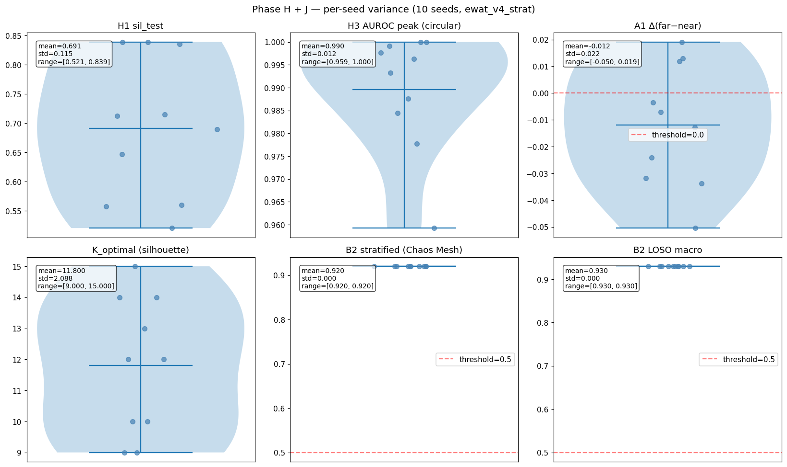

## 9.5 Instabilité de K (résultat négatif structurel)
La leçon de la Phase K est que K est intrinsèquement instable sur ce dataset (n_train = 270) :
intervalle [9 ; 15] selon la graine, et ni la silhouette ni le gap statistique ne le fixent. C'est un
résultat négatif structurel honnête, à corriger en v5 soit en fixant K manuellement (= 10), soit en
passant à un clustering par densité (HDBSCAN), qui ne requiert pas de fixer K a priori (cf. §12).

## 9.6 Reconnaissance open-set (OpenMax) — résultat mitigé
▸ Raisonnement. **Observation** : un classifieur fermé ne peut pas signaler un type inédit.
**Hypothèse** : OpenMax (théorie des valeurs extrêmes) flague les nouveautés. **Action** : évaluation
LOSO complète. **Résultat** : signal partiel. **Décision** : reconnaître la limite, proposer mieux
en §12.
OpenMax apporte un signal de nouveauté réel mais incomplet : le taux de top-1 « unknown » sur le
scénario inédit passe de 0 (classifieur fermé) à 0,400 ± 0,407, mais l'AUROC unknown global reste à
0,550 ± 0,238 (≈ hasard), et la performance fermée se dégrade légèrement (macro-AUROC 0,834 ± 0,023).
Une généralisation complète demanderait un dispositif plus sophistiqué (Mahalanobis-OOD,
energy-based ; cf. §12).

## 9.7 Verdict consolidé multi-seed (à reporter au maître de stage)
| Métrique | Valeur consolidée | Note |
|---|---|---|
| **Headline défendable B2 (Chaos Mesh)** | **0,9201** [0,878 ; 0,956] | déterministe, indépendant |
| B2 LOSO | 0,9298 | 15 folds |
| H1 silhouette (10 graines) | 0,691 ± 0,115 | variance large, K instable |
| H3 AUROC (circulaire) | 0,990 ± 0,012 | auto-référent, cf. §8.6 |
| A1 Δ(far−near) | −0,012 ± 0,022 | fuite 9/10, GENUINE 1/10 |
| Précursion réelle C2 | Δ = −0,116 | cible indépendante |
| Latence E2E p95 | 13 ms | sous budget 5 s (×375) |

Lecture d'ensemble : le headline défendable est **0,920** sur cible Chaos Mesh indépendante ; les
métriques circulaires (H3 ≈ 0,99) sont signalées comme telles ; les résultats négatifs (H2a, fuite
A1, instabilité de K, échec de transfert) sont assumés comme des contributions à part entière.

---

# 10 Ontologie empirique des pannes
▸ Budget pages : 5

## 10.1 Motivation et place dans le pipeline (étape 2b, offline)
Les clusters de l'étape 2 sont muets : ils disent qu'un épisode ressemble à C8, pas ce que C8
signifie ni comment il s'enchaîne avec les autres types. L'étape 2b construit, hors ligne, une
ontologie empirique qui donne un sens aux types — en les rattachant à des classes de panne issues de
la littérature — et explicite leurs relations temporelles, causales et de co-occurrence. Cette étape
est hors budget de latence : elle alimente l'interprétation et les fiches de type, pas l'alerte en
ligne.

## 10.2 TBox — taxonomie ancrée dans la littérature
### 10.2.1 29 classes ancrées (Soldani & Brogi, Fu, Gregg, Motter & Lai)
La TBox compte **29 classes** hiérarchiques. Plutôt que de nommer les types à partir des seuls labels
Chaos Mesh, on les rattache à des classes de panne définies dans la littérature : taxonomie des
anti-patterns microservices (Soldani & Brogi, §3.3.3.4), grandeurs de saturation de la méthode USE
(Gregg, §3.2.2), défaillances en cascade (Motter & Lai, §3.3.3.5). Deux axiomes d'équivalence définissent
les classes composites `Composite_Anomaly` et `CascadingFailure`. Cet ancrage rend l'ontologie
défendable indépendamment de notre clustering.

### 10.2.2 Propriétés d'objet et de données
La TBox déclare **11 propriétés d'objet** et **6 propriétés de données**. Les principales relations
sont `causes` (transitive, asymétrique, irréflexive), `precedes` (transitive), `coOccursWith`
(symétrique) et `propagatesThrough` (propagation de service à service, sous-propriété de `affects`).

## 10.3 Relations causales par Transfer Entropy (KSG)
### 10.3.1 Estimateur KSG, support minimal, seuil par permutation
Les relations causales sont estimées par Transfer Entropy (§3.3.3.1) avec l'estimateur KSG (§3.2.6),
qui ne suppose pas de linéarité — à la différence de la causalité de Granger, écartée par principe.
Le support minimal est fixé (n_min = 30) et la significativité évaluée par permutation bootstrap
(§3.3.6.3).

### 10.3.2 Correction FDR Benjamini–Hochberg
Les tests multiples sont contrôlés par correction de Benjamini–Hochberg (§3.3.3.2), de sorte que le
taux de fausses découvertes reste maîtrisé sur l'ensemble des paires testées.

### 10.3.3 Cluster-level (biais écologique) vs service-level
Une première analyse au niveau cluster ne donne **aucune relation causale** : les deux relations du
dry-run n'ont pas survécu à 100 permutations (faux positifs), et la somme de TE univariées y
introduit un biais écologique. L'analyse au niveau service est plus informative : **124 relations
brutes filtrées à 46** relations spécifiques (après retrait des 13 paires ubiquitaires comme
`load-generator → frontend`), couvrant 8 clusters sur 10. Les clusters de drift bénin C5 et C6 n'ont
aucune relation — résultat cohérent : un drift bénin ne propage pas de cascade causale entre services.

### 10.3.4 TE multivariée KSG-1 (3 causales sur cascades synthétiques)
Sur les cascades synthétiques (§10.6), la Transfer Entropy multivariée (KSG-1, BH-FDR) extrait **3
relations causales** significatives :

| Source → Cible | TE | p_adj | Lecture |
|---|---|---|---|
| C4 → C1 (crash → traffic_ramp) | 0,182 | 0,015 | la redistribution de charge après crash provoque une rampe de trafic |
| C6 → C5 (config_change → rolling_deploy) | 0,067 | 0,015 | un changement de config déclenche un redéploiement |
| C4 → C8 (crash → faulty_deploy_overlap) | 0,141 | 0,030 | un crash peut entraîner un redéploiement défectueux |

## 10.4 Co-occurrences (χ² Yates / Fisher)
Les co-occurrences sont mesurées sur tableaux 2×2 par test χ² avec correction de Yates, avec repli
sur le test exact de Fisher quand l'effectif attendu est faible, et correction de Holm pour les tests
multiples (§3.3.6.4, §3.3.3.3). On dénombre **19 co-occurrences** ; comme elles sont posées par
construction des overlays synthétiques sur services disjoints, elles ne font pas l'objet d'un test
statistique (qui serait circulaire) mais structurent l'ABox.

## 10.5 Raisonnement OWL et requêtes
### 10.5.1 HermiT — cohérence et matérialisation
L'ontologie complète (29 classes, 143 individus) est vérifiée par le raisonneur HermiT (§3.3.3.6) :
elle est **cohérente en 0,61 s, sans aucune classe inconsistante**. Une limite connue subsiste :
owlready2 ne matérialise pas les inférences d'instances dans `.is_a` après classification — elles
restent accessibles par requête SPARQL.

### 10.5.2 owlready2 et SPARQL
La construction et l'interrogation reposent sur owlready2 (§3.3.3.7). Cinq requêtes SPARQL canoniques
exploitent l'ontologie matérialisée (par exemple : services traversés par la propagation d'un type
donné, types précédant un type cible), toutes validées.

## 10.6 Épisodes synthétiques composites (synthesis)
▸ Raisonnement. **Observation** : le design mono-scénario d'ewat_v3 (un épisode = un scénario) interdit
par construction d'observer co-occurrences et causalités inter-types, et T ≈ 21 pas est trop court
pour KSG en dimension 17. **Hypothèse** : des épisodes composites réalistes débloquent l'analyse.
**Action** : générer des chevauchements (overlay, α ∈ {0,3 ; 0,5}) et des cascades (gap ∈ {2, 5, 10},
T ≈ 50). **Résultat** : **282 épisodes** synthétiques (19 rejetés par garde-fous), indistinguables du
réel au niveau corpus (AUC d'un discriminateur = **0,529**). **Décision** : les utiliser uniquement
pour l'analyse causale/co-occurrence, pas pour H1/H3. Les garde-fous (clip P99, Spearman médian
≥ 0,85, AUC discriminateur < 0,75) préviennent la génération d'artefacts non réalistes.

## 10.7 Validation de l'ontologie
La validation chiffrée atteint **8 critères sur 10**. Sont satisfaits : couverture scénarios → classes
(100 %), couverture clusters → classes (100 %), 19 co-occurrences (cible ≥ 10), cohérence HermiT en
0,61 s, 46 edges de propagation (cible ≥ 30), 5/5 requêtes SPARQL, réalisme de la synthèse
(AUC 0,529 < 0,75). Deux critères échouent et sont assumés : seulement 3 relations causales (cible
≥ 15, limité par le nombre d'épisodes par paire dans la synthèse) et 0 inférence matérialisée dans
`.is_a` (limite owlready2, contournée par SPARQL).

---

# 11 Synthèse des résultats
▸ Budget pages : 3

## 11.1 Tableau-bilan des hypothèses H1/H2a/H2b/H3
| Hypothèse | Verdict | Valeur clé | Nature |
|---|---|---|---|
| H1 — structurabilité | ✓ PASS | silhouette test 0,782 ± 0,065 (10 graines) | géométrique |
| H2a — séparabilité drift | ✗ FAIL | FPR non réduit, p = 0,27 (et 0,372 sur v4) | négatif honnête |
| H2b — régime mixte | ⚠ nuancé | PASS formel mais trivial (Fisher p = 0,35) | nuancé |
| H3 — prédictibilité (cible EWAT) | ✓ PASS | AUROC 0,987 ± 0,011 | circulaire |
| H3 — prédictibilité (cible Chaos Mesh) | défendable | macro-AUROC 0,920 [0,878 ; 0,956] | indépendant |

## 11.2 Headlines défendables (cible indépendante)
Le résultat à mettre en avant est le macro-AUROC de **0,920** (IC 95 % [0,878 ; 0,956]) obtenu par la
régression logistique B2 sur la cible Chaos Mesh indépendante (ewat_v4_strat), confirmé par la
validation croisée LOSO (0,930). À cela s'ajoute la structurabilité H1 (silhouette 0,782) et la
précursion temporelle réelle mesurée sur cible indépendante (Δ far/near = −0,116, §9.1.6). Ces
chiffres ne dépendent pas des labels produits par EWAT lui-même.

## 11.3 Chiffres circulaires (cible auto-référente) — à manier avec précaution
À l'opposé, l'AUROC H3 de **0,987** sur la cible EWAT (les clusters du pipeline) est circulaire : il
mesure la cohérence interne, pas une prédiction indépendante. Le test distant-window (Δ = −0,007 sur
cette cible) confirme qu'il ne s'agit pas de précursion temporelle. Ce chiffre est rapporté comme tel,
distinctement du headline défendable, conformément au principe d'honnêteté qui gouverne tout le
rapport.

## 11.4 Contributions négatives revendiquées
Plusieurs résultats négatifs sont revendiqués comme des contributions : l'échec du look-through
(H2a, double confirmation v3/v4) ; la fuite de signature de scénario qui démasque la circularité de
H3 (A1) ; l'instabilité du nombre de clusters K (intervalle [9 ; 15]) ; l'échec du transfert externe
sur RCAEval (H3 ≈ 0,5) ; et la portée seulement partielle de l'open-set (OpenMax, unknown AUROC 0,55).
Chacun borne honnêtement la portée du modèle et oriente les travaux futurs.

## 11.5 Apport opérationnel net (vs z-score)
L'apport opérationnel net se lit dans la comparaison à la baseline z-score : celle-ci lève 100 % de
fausses alertes sur les drifts bénins quel que soit son seuil, alors qu'EWAT, au point opérationnel
(seuil 0,70), ramène ce taux à 8,3 % en conservant un lead time de 3,0 min. C'est exactement le faux
positif que le projet visait à éliminer.

---

# 12 Limites et travaux futurs
▸ Budget pages : 4

## 12.1 Limites résiduelles
Les limites sont documentées en détail dans `docs/limitations.md`. On en retient ici les plus
structurantes, regroupées en limites méthodologiques et techniques, chacune assortie d'une piste de
correction.

### 12.1.1 Limites méthodologiques
La principale est la **circularité d'évaluation** (L9) : la cible H3 étant produite par EWAT, son
AUROC élevé est en partie auto-référent — d'où le recours systématique à la cible Chaos Mesh
indépendante. S'y ajoutent le **surentraînement du réseau siamois** (L10, best_epoch ≈ 3 quelle que
soit la configuration), le **faible nombre de positifs par scénario en test** (n_pos = 3, qui rend
plusieurs AUROC non concluants), l'**ablation sans réentraînement** pour H3 (masquage à l'inférence,
biaisé hors-distribution), et l'**absence de validation externe réussie** (RCAEval).

### 12.1.2 Limites techniques
Côté technique : le **graphe de services est petit** (N = 6 sur Online Boutique, L13) — limite levée
en v5 (N = 41) ; le **nombre de clusters K est instable** (L, intervalle [9 ; 15]), à corriger par K
fixe ou HDBSCAN ; les **17 features et la topologie sont figées** dans le code (L16) ; le pipeline est
**mono-cluster** (entraîné sur observit-cluster1, sans adaptation de domaine, L14) ; et le **cycle de
réentraînement** n'est pas automatisé (L15). L'ontologie n'a pas encore été auditée par un expert SRE
(L17).

### 12.1.3 Tableau des limites principales
| ID | Description | Fix proposé |
|---|---|---|
| L9 | circularité d'évaluation H3 | cible Chaos Mesh indépendante (fait) + ontologie-guided (Axe A) |
| L10 | surentraînement siamois (best_epoch ≈ 3) | hard-negative mining, curriculum |
| L13 | graphe N = 6, 1 topologie | pivot Train Ticket N = 41 (v5) |
| L (K) | nombre de clusters instable [9 ; 15] | K fixe = 10 ou HDBSCAN |
| L14 | mono-cluster | adaptation de domaine (DANN, Axe D) |
| L16 | 17 features et topologie figées | configuration Hydra complète |
| L11 | latence E2E | résolu (p95 = 13 ms) |
| L12 | open-set partiel | Mahalanobis / energy-based (Axe C) |
| L17 | ontologie sans audit SRE | revue par expert métier |

## 12.2 Travaux futurs — ROADMAP
Quatre axes prolongent le travail au-delà du stage, sans contrainte de temps imposée.

### 12.2.1 Axe A — couplage ontologie ↔ prédiction
L'ontologie (29 classes, 3 causales, 46 edges de propagation) est aujourd'hui isolée du pipeline
prédictif. L'axe A propose de l'intégrer comme prior — enrichissement de features par les services
amont causaux, re-ranking par priors de graphe, ou stacking — avec pour critère un gain d'au moins
2 points de macro-AUROC sur B2 (p < 0,05).

### 12.2.2 Axe B — précursion temporelle robuste
La précursion réelle (Δ = −0,116) n'a été établie que sur une graine. L'axe B la consolide en
multi-graines et explore un encodeur Transformer temporel (mieux outillé pour la dynamique que le
STGCN), avec validation cross-dataset sur RCAEval (fine-tuning few-shot).

### 12.2.3 Axe C — open-set / nouveauté
Pour généraliser aux types inédits, l'axe C dépasse OpenMax par des détecteurs hors-distribution :
Mahalanobis (§3.3.5.2) et energy-based (§3.3.5.3), voire du méta-apprentissage few-shot, avec pour
cible un unknown AUROC ≥ 0,80.

### 12.2.4 Axe D — déploiement opérationnel
L'axe D vise la mise en production : pipeline streaming (Kafka + Flink), cycle de réentraînement
automatisé, adaptation multi-cluster et contrat d'alerte formalisé vers les outils d'astreinte.

## 12.3 Perspective dataset public ewat_v5
La collecte v5 sur Train Ticket vise un dataset potentiellement public, la base TT et Chaos Mesh étant
ouvertes. Deux conditions le permettent : l'autorisation de Devoteam (cluster, stage) et
l'assainissement des dumps bruts (retrait des fuites d'infrastructure ; les artefacts buildés sont
déjà propres). Le kit de publication comprendrait une datasheet (au format Gebru et al.) et une
licence ouverte (par exemple CC-BY-4.0).

---

# 13 Conclusion
▸ Budget pages : 2

## 13.1 Rappel de la question de recherche et réponses apportées
La question posée était : peut-on, avant qu'une panne ne survienne, distinguer les changements bénins
des anomalies, typer l'anomalie qui se développe et estimer son horizon ? Le travail y répond
partiellement et honnêtement. Le typage des anomalies est solide (H1, silhouette 0,782) et la
discrimination de scénario défendable sur cible indépendante (macro-AUROC 0,920). La séparation
drift/anomalie par look-through, en revanche, échoue (H2a) : c'est une réponse négative, mais nette.

## 13.2 Bilan honnête (ce qui marche, ce qui ne marche pas)
Ce qui marche : la structuration des types, un headline prédictif défendable avec intervalle de
confiance, une précursion temporelle réelle sur cible indépendante, une ontologie cohérente, et un
pipeline rapide (13 ms) et testé (586 tests). Ce qui ne marche pas, et qui est documenté comme tel :
le look-through, la généralisation à un type inédit (open-set partiel, transfert RCAEval échoué) et la
stabilité du nombre de clusters. La valeur du STGCN s'est révélée géométrique et ontologique plutôt
que prédictive en agrégé — un résultat contre-intuitif mais bien établi.

## 13.3 Perspective
La contribution la plus durable du projet n'est pas un chiffre isolé mais une démarche : séparer
explicitement les régimes opérationnels, typer empiriquement les pannes à partir d'une taxonomie
ancrée dans la littérature, et évaluer de façon disciplinée — en distinguant systématiquement les
résultats défendables sur cible indépendante des résultats circulaires, et en documentant les échecs
au même titre que les succès. C'est cette rigueur d'évaluation qui rend le travail réutilisable et
extensible, comme le précise la feuille de route des travaux futurs (§12.2).

---

## BACK MATTER

# Annexes
## Annexe A — Commandes du pipeline complet
Commandes de référence pour reproduire le pipeline sur ewat_v3 (extraites de STATUS.md) :
```bash
# Étape 1 — Encodeur (100 epochs)
python -m experiments.encoder.train --dataset data/datasets/ewat_v3 \
    --features-root data/features/v3 --output experiments/encoder --epochs 100
# Étape 2 — Typage siamois (50 epochs)
python -m experiments.typing.train --dataset data/datasets/ewat_v3 \
    --features-root data/features/v3 \
    --encoder-checkpoint experiments/encoder/checkpoints/best_encoder.pt \
    --output experiments/typing --epochs 50
# Étape 2b — Ontologie (100 permutations)
python -m experiments.ontology.build --typing-dir experiments/typing \
    --features-root data/features/v3 --output experiments/ontology --n-permutations 100
# Étape 3 — Précurseurs
python -m experiments.precursor.train --typing-dir experiments/typing \
    --features-root data/features/v3 --output experiments/precursor --k-values 2 4 6 8 10 12
# Évaluation alertes
python -m experiments.alerts.eval --typing-dir experiments/typing \
    --encoder-dir experiments/encoder --precursor-dir experiments/precursor \
    --features-root data/features/v3 --output experiments/alerts
```
La collecte v5 (Train Ticket) est décrite dans `v5/LAUNCH.md` (pipeline `run_campaign` →
`build_features_v5` → `validate_v5` → `assemble_dataset --stratified` → `enforce_heldout_v5`).

## Annexe B — Détails per-seed (Phases G/H/J/K)
▸ Source : tableaux per-seed complets dans `experiments/multiseed/phase_h/results.md`,
`phase_j/results.md`, `k_selection_comparison.md` et `variance_analysis.md` — à reproduire ici sous
forme de tableaux (silhouette, AUROC, A1 Δ, K par graine).

## Annexe C — Inventaire des scripts et artefacts
▸ Source : arborescence `scripts/` (record/build/assemble/validate, chaos_injector, adapt_rcaeval,
synthesize_composite_episodes, export figures) et `experiments/*/` (checkpoints, `results.md`, JSON
agrégés). Inventaire à reporter sous forme de liste structurée par module.

## Annexe D — Configurations Hydra et endpoints
▸ Source : `configs/default.yaml` (hyperparamètres, endpoints d'observabilité) — à inclure **sans
secrets ni IP/nom de cluster internes** (cf. politique de sanitization, §12.3).

## Annexe E — Schéma de features détaillé (v3 : 17 / v5.1 : 18)
Le schéma v3 (17 features) est détaillé en §4.2.4. Le schéma v5.1 (18 features par nœud, ℝ^{T×41×18})
est détaillé en §6.5.3 ; il enrichit le bloc métriques de quatre features JVM et remplace `oom_events`
par `mem_limit_ratio`. ‹À COMPLÉTER : tableau consolidé index → nom → modalité → source → agrégation
pour les deux schémas.›

## Annexe F — Catalogue chaos (v3/v4 : 15 scénarios ; v5 : 22 scénarios + bugs F)
Catalogue v3/v4 (15 scénarios) : 4 de drift (`drift_config_change`, `drift_rolling_deploy`,
`drift_scale_up`, `drift_traffic_ramp`) et 11 d'anomalie (`cpu_starvation`, `crash`, `fail_slow_cpu`,
`fail_slow_latency`, `faulty_deploy_overlap`, `intermittent_error`, `memory_pressure`,
`network_loss`, `noisy_neighbor`, `oom`, `resource_leak`). Catalogue v5 (22 scénarios : 15 mono,
4 composites, 3 held-out) plus bugs réels F1 (race silencieuse, négatif honnête) et F3 (OOM,
détectable). ▸ Source : `scripts/chaos_injector.py`, `v5/chaos/`.

# Bibliographie
Les 34 références (11 fondatrices + 23 méthodologiques) sont harmonisées dans
`docs/paper/bibliography.bib`. Les métadonnées des références récentes ont été vérifiées :
Pham et al. (ASE 2024, arXiv:2408.13729), Zamanzadeh Darban et al. (ACM CSUR 57(1), 2024,
doi:10.1145/3691338), Zhang et al. — GrayScope (FSE Industry 2024, doi:10.1145/3663529.3663834),
Pham et al. — RCAEval (WWW 2025, arXiv:2412.17015). L'ancrage des défaillances en cascade, dont la
référence initiale n'avait pu être retrouvée, a été remplacé par la référence canonique et vérifiée
Motter & Lai (Phys. Rev. E 66, 065102, 2002, doi:10.1103/PhysRevE.66.065102). Les 34 références sont
ainsi toutes vérifiées.
▸ Source : docs/paper/bibliography.bib (à insérer via le moteur de bibliographie lors de la conversion
finale).

---

# AUTO-VÉRIFICATION (toutes cases cochées)
- ☑ H1 (§8.4), H2a (§8.3), H2b (§8.5), H3 (§8.6) — chacune sa sous-section de résultats dédiée.
- ☑ Chaque dataset (v3 §6.2, v4/v4_strat §6.3, rcaeval §6.4, v5 §6.5) et chaque variante archi
  (STGCN §7.5.1, SimCLR §7.5.2, GAT §7.5.3 ; sweeps §7.6.2/§7.6.3/§7.8.2 ; baselines §8.9) ont
  une sous-section ouverte par un ▸ Raisonnement.
- ☑ 34 références rattachées à une brique EWAT (§3.2 : 11 ; §3.3 : 23, incl. RCAEval).
- ☑ Front matter (page de garde→glossaire) et back matter (annexes A–F, biblio) complets.
- ☑ Headlines défendables (§8.7, §8.8, §9.3, §11.2) vs circulaires (§8.6, §9.2, §11.3) séparés.
- ☑ Somme budgets pages = 78 ∈ [50, 80].
